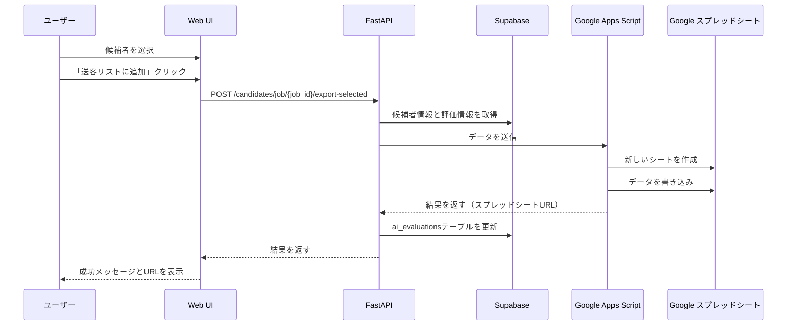

# Design Document

## Overview

「送客リストのスプレッドシート出力機能」は、AIマッチングシステムで評価された候補者情報を選択し、Google スプレッドシートに出力する機能です。この機能により、リクルーターは候補者情報をクライアントと簡単に共有できるようになります。また、送客履歴を管理するために、`ai_evaluations` テーブルに送客状態を記録します。

## Architecture

システムは以下のコンポーネントで構成されます：

1. **フロントエンド（Web UI）**
   - 候補者一覧画面
   - 候補者選択機能
   - 「送客リストに追加」ボタン

2. **バックエンド（FastAPI）**
   - 候補者データ取得API
   - スプレッドシート出力リクエスト処理API
   - データベース更新処理

3. **Google Apps Script (GAS)**
   - スプレッドシートへのデータ出力処理
   - スプレッドシートフォーマット設定

4. **データベース（Supabase）**
   - `ai_evaluations` テーブル（送客状態管理）
   - `candidates` テーブル（候補者情報）



## Components and Interfaces

### 1. フロントエンド

**候補者一覧画面の拡張**
- 送客済み候補者の視覚的表示（バッジ）
- 統計情報に送客済み候補者数の表示
- スプレッドシートURLを開くオプション

**インターフェース**
- `exportToSheets()` 関数：選択した候補者をスプレッドシートに出力
- `updateSentStatus()` 関数：送客済み候補者の表示を更新

### 2. バックエンド

**APIエンドポイント**
- `POST /candidates/job/{job_id}/export-selected`：選択した候補者をスプレッドシートに出力

**データ処理**
- 候補者情報と評価情報の取得
- GASエンドポイントへのデータ送信
- `ai_evaluations` テーブルの更新

### 3. Google Apps Script (GAS)

**エンドポイント**
- `doPost(e)` 関数：データを受け取りスプレッドシートに出力

**機能**
- 新しいシートの作成
- 基本情報の書き込み
- 候補者データの書き込み
- スプレッドシートのフォーマット設定

### 4. データベース

**テーブル拡張**
- `ai_evaluations` テーブルに以下のフィールドを追加：
  - `sent_to_sheet`: 送客済みフラグ（ブーリアン）
  - `sent_to_sheet_at`: 送客日時（タイムスタンプ）

## Data Models

### 1. 既存テーブルの拡張

```sql
-- ai_evaluationsテーブルの拡張
ALTER TABLE ai_evaluations
ADD COLUMN IF NOT EXISTS sent_to_sheet BOOLEAN DEFAULT FALSE,
ADD COLUMN IF NOT EXISTS sent_to_sheet_at TIMESTAMP WITH TIME ZONE;
```

### 2. APIリクエスト/レスポンス

**リクエスト**
```json
{
  "selected_candidate_ids": ["uuid1", "uuid2", "uuid3"]
}
```

**レスポンス**
```json
{
  "success": true,
  "message": "3件の候補者をスプレッドシートに追加しました",
  "spreadsheet_url": "https://docs.google.com/spreadsheets/d/..."
}
```

### 3. GASリクエスト

```json
{
  "job_id": "job-uuid",
  "client_name": "株式会社サンプル",
  "requirement_title": "シニアエンジニア",
  "submission_count": 3,
  "submitted_by": "山田太郎",
  "submitted_at": "2025-07-22T10:30:00Z",
  "candidates": [
    {
      "candidate_id": "BR12345",
      "candidate_company": "株式会社テック",
      "candidate_link": "https://example.com/candidate/BR12345",
      "gender": "M",
      "age": 35,
      "enrolled_company_count": 3,
      "platform": "bizreach",
      "ai_score": 85,
      "recommendation": "A",
      "strengths": ["技術力が高い", "リーダーシップ経験あり"],
      "concerns": ["業界経験が少ない"],
      "reason": "技術スキルとリーダーシップ経験が求められるポジションに適している",
      "evaluation_id": "eval-uuid"
    },
    // 他の候補者...
  ]
}
```

## Error Handling

1. **候補者データ取得エラー**
   - エラーメッセージをログに記録
   - ユーザーにエラーを通知

2. **GASエンドポイント呼び出しエラー**
   - タイムアウト処理（30秒）
   - エラーメッセージをログに記録
   - ユーザーにエラーを通知

3. **スプレッドシート出力エラー**
   - GASスクリプト内でのエラーハンドリング
   - エラー情報をレスポンスに含める

4. **データベース更新エラー**
   - トランザクション処理
   - エラーメッセージをログに記録

## Testing Strategy

1. **ユニットテスト**
   - バックエンドAPI関数のテスト
   - GASスクリプト関数のテスト

2. **統合テスト**
   - APIエンドポイントとGASの連携テスト
   - データベース更新の検証

3. **UIテスト**
   - 候補者選択と送客処理のE2Eテスト
   - 送客済み表示の検証

4. **エラーケーステスト**
   - GASエンドポイント未設定時の挙動
   - ネットワークエラー時の挙動
   - 権限エラー時の挙動

## Security Considerations

1. **認証・認可**
   - ユーザー認証の確認
   - 適切な権限チェック

2. **環境変数管理**
   - GASエンドポイントURLの安全な管理
   - スプレッドシートIDの安全な管理

3. **データ保護**
   - 個人情報の適切な取り扱い
   - 必要最小限のデータ送信