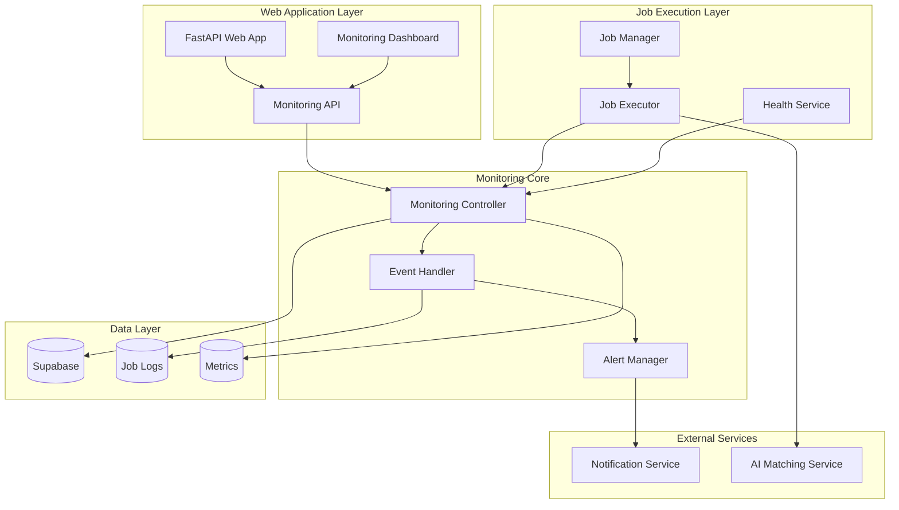

# Design Document

## Overview

The Job Execution Monitoring and Debugging System is designed to provide comprehensive visibility and control over job execution in the recruitment automation platform. The system will integrate with the existing FastAPI web application and Supabase database to provide real-time monitoring, detailed error tracking, and proactive alerting capabilities.

## Architecture

### High-Level Architecture



### Component Architecture

The system follows a modular architecture with clear separation of concerns:

1. **Monitoring Controller**: Central orchestrator for all monitoring activities
2. **Job Manager**: Enhanced job execution management with monitoring integration
3. **Event Handler**: Processes and routes monitoring events
4. **Alert Manager**: Handles alert generation and notification routing
5. **Health Service**: Performs system health checks and diagnostics

## Components and Interfaces

### 1. Monitoring Controller

**Purpose**: Central hub for collecting, processing, and storing monitoring data.

**Key Methods**:
- `start_job_monitoring(job_id: str, job_type: str, parameters: dict)`
- `update_job_progress(job_id: str, progress: int, status: str, details: dict)`
- `record_job_error(job_id: str, error: Exception, context: dict)`
- `complete_job_monitoring(job_id: str, result: dict)`

**Interfaces**:
```python
class MonitoringController:
    def __init__(self, supabase_client, alert_manager):
        self.supabase = supabase_client
        self.alert_manager = alert_manager
        self.active_jobs = {}
    
    async def start_job_monitoring(self, job_id: str, job_type: str, parameters: dict) -> None
    async def update_job_progress(self, job_id: str, progress: int, status: str, details: dict = None) -> None
    async def record_job_error(self, job_id: str, error: Exception, context: dict = None) -> None
    async def complete_job_monitoring(self, job_id: str, result: dict) -> None
    async def get_job_status(self, job_id: str) -> dict
    async def get_active_jobs(self) -> List[dict]
```

### 2. Enhanced Job Manager

**Purpose**: Manages job execution lifecycle with integrated monitoring.

**Key Features**:
- Automatic monitoring initialization
- Progress tracking with configurable intervals
- Error capture and context preservation
- Retry mechanism with exponential backoff

**Interfaces**:
```python
class EnhancedJobManager:
    def __init__(self, monitoring_controller, retry_config):
        self.monitoring = monitoring_controller
        self.retry_config = retry_config
    
    async def execute_job(self, job_id: str, job_config: dict) -> dict
    async def retry_job(self, job_id: str, attempt: int) -> bool
    async def cancel_job(self, job_id: str) -> bool
    def get_job_executor(self, job_type: str) -> JobExecutor
```

### 3. Alert Manager

**Purpose**: Handles alert generation, escalation, and notification delivery.

**Alert Types**:
- Job failure alerts (immediate)
- Performance degradation warnings
- System health alerts
- Resource utilization alerts

**Interfaces**:
```python
class AlertManager:
    def __init__(self, notification_service, alert_rules):
        self.notification_service = notification_service
        self.alert_rules = alert_rules
    
    async def process_alert(self, alert_type: str, severity: str, data: dict) -> None
    async def escalate_alert(self, alert_id: str) -> None
    def should_alert(self, event_type: str, data: dict) -> bool
    async def send_notification(self, recipients: List[str], message: str, priority: str) -> None
```

### 4. Health Service

**Purpose**: Performs automated health checks and system diagnostics.

**Health Checks**:
- Database connectivity and query performance
- External API availability
- System resource utilization
- Job queue health

**Interfaces**:
```python
class HealthService:
    def __init__(self, supabase_client, external_services):
        self.supabase = supabase_client
        self.external_services = external_services
    
    async def run_health_checks(self) -> dict
    async def check_database_health(self) -> dict
    async def check_external_services(self) -> dict
    async def check_system_resources(self) -> dict
    async def validate_table_structures(self) -> dict
```

## Data Models

### Job Execution Logs

```sql
CREATE TABLE job_execution_logs (
    id UUID PRIMARY KEY DEFAULT gen_random_uuid(),
    job_id UUID NOT NULL REFERENCES jobs(id),
    event_type VARCHAR(50) NOT NULL, -- 'started', 'progress', 'error', 'completed'
    timestamp TIMESTAMPTZ NOT NULL DEFAULT NOW(),
    status VARCHAR(20) NOT NULL,
    progress INTEGER DEFAULT 0,
    message TEXT,
    details JSONB,
    error_details JSONB,
    execution_time_ms INTEGER,
    memory_usage_mb INTEGER,
    created_at TIMESTAMPTZ DEFAULT NOW()
);
```

### System Health Metrics

```sql
CREATE TABLE system_health_metrics (
    id UUID PRIMARY KEY DEFAULT gen_random_uuid(),
    timestamp TIMESTAMPTZ NOT NULL DEFAULT NOW(),
    metric_type VARCHAR(50) NOT NULL, -- 'database', 'api', 'resource', 'job_queue'
    metric_name VARCHAR(100) NOT NULL,
    metric_value DECIMAL(10,2) NOT NULL,
    status VARCHAR(20) NOT NULL, -- 'healthy', 'warning', 'critical'
    details JSONB,
    created_at TIMESTAMPTZ DEFAULT NOW()
);
```

### Alert History

```sql
CREATE TABLE alert_history (
    id UUID PRIMARY KEY DEFAULT gen_random_uuid(),
    alert_type VARCHAR(50) NOT NULL,
    severity VARCHAR(20) NOT NULL, -- 'info', 'warning', 'error', 'critical'
    title VARCHAR(200) NOT NULL,
    message TEXT NOT NULL,
    job_id UUID REFERENCES jobs(id),
    triggered_at TIMESTAMPTZ NOT NULL DEFAULT NOW(),
    resolved_at TIMESTAMPTZ,
    recipients TEXT[],
    notification_sent BOOLEAN DEFAULT FALSE,
    escalated BOOLEAN DEFAULT FALSE,
    created_at TIMESTAMPTZ DEFAULT NOW()
);
```

### Job Retry History

```sql
CREATE TABLE job_retry_history (
    id UUID PRIMARY KEY DEFAULT gen_random_uuid(),
    job_id UUID NOT NULL REFERENCES jobs(id),
    attempt_number INTEGER NOT NULL,
    started_at TIMESTAMPTZ NOT NULL DEFAULT NOW(),
    completed_at TIMESTAMPTZ,
    status VARCHAR(20) NOT NULL, -- 'success', 'failed', 'cancelled'
    error_message TEXT,
    retry_delay_seconds INTEGER,
    created_at TIMESTAMPTZ DEFAULT NOW()
);
```

## Error Handling

### Error Classification

1. **Transient Errors**: Network timeouts, temporary database unavailability
2. **Configuration Errors**: Missing API keys, invalid parameters
3. **Data Errors**: Malformed input, constraint violations
4. **System Errors**: Out of memory, disk space issues

### Error Handling Strategy

```python
class ErrorHandler:
    def __init__(self, monitoring_controller, retry_config):
        self.monitoring = monitoring_controller
        self.retry_config = retry_config
    
    async def handle_job_error(self, job_id: str, error: Exception, context: dict) -> ErrorAction:
        error_type = self.classify_error(error)
        
        if error_type == ErrorType.TRANSIENT:
            return await self.handle_transient_error(job_id, error, context)
        elif error_type == ErrorType.CONFIGURATION:
            return await self.handle_configuration_error(job_id, error, context)
        elif error_type == ErrorType.DATA:
            return await self.handle_data_error(job_id, error, context)
        else:
            return await self.handle_system_error(job_id, error, context)
    
    def classify_error(self, error: Exception) -> ErrorType:
        # Error classification logic
        pass
```

### Retry Mechanism

```python
class RetryManager:
    def __init__(self, max_attempts=3, base_delay=1.0, max_delay=300.0):
        self.max_attempts = max_attempts
        self.base_delay = base_delay
        self.max_delay = max_delay
    
    def calculate_delay(self, attempt: int) -> float:
        # Exponential backoff with jitter
        delay = min(self.base_delay * (2 ** attempt), self.max_delay)
        jitter = random.uniform(0.1, 0.3) * delay
        return delay + jitter
    
    async def should_retry(self, error: Exception, attempt: int) -> bool:
        if attempt >= self.max_attempts:
            return False
        
        # Check if error is retryable
        return self.is_retryable_error(error)
```

## Testing Strategy

### Unit Testing

1. **Component Testing**: Test each monitoring component in isolation
2. **Error Simulation**: Test error handling with various error scenarios
3. **Alert Testing**: Verify alert generation and notification delivery
4. **Health Check Testing**: Test all health check scenarios

### Integration Testing

1. **End-to-End Job Monitoring**: Test complete job lifecycle monitoring
2. **Database Integration**: Test monitoring data persistence and retrieval
3. **External Service Integration**: Test notification service integration
4. **Performance Testing**: Test monitoring overhead and scalability

### Test Data Setup

```python
class MonitoringTestSetup:
    @staticmethod
    async def create_test_job(job_type: str = "ai_matching") -> dict:
        # Create test job data
        pass
    
    @staticmethod
    async def simulate_job_error(job_id: str, error_type: str) -> None:
        # Simulate various error conditions
        pass
    
    @staticmethod
    async def create_test_alerts() -> List[dict]:
        # Create test alert scenarios
        pass
```

### Monitoring Dashboard Design

The monitoring dashboard will provide:

1. **Real-time Job Status**: Live view of all active jobs
2. **Performance Metrics**: Charts showing execution times, success rates
3. **Error Analysis**: Error frequency, types, and resolution status
4. **System Health**: Overall system status and component health
5. **Alert Management**: Active alerts and alert history

### API Endpoints

```python
# Monitoring API endpoints
@app.get("/api/monitoring/jobs")
async def get_active_jobs() -> List[dict]

@app.get("/api/monitoring/jobs/{job_id}")
async def get_job_details(job_id: str) -> dict

@app.get("/api/monitoring/health")
async def get_system_health() -> dict

@app.get("/api/monitoring/metrics")
async def get_performance_metrics(timeframe: str = "1h") -> dict

@app.get("/api/monitoring/alerts")
async def get_active_alerts() -> List[dict]

@app.post("/api/monitoring/alerts/{alert_id}/resolve")
async def resolve_alert(alert_id: str) -> dict
```

This design provides a comprehensive monitoring solution that addresses all the requirements while integrating seamlessly with the existing system architecture.