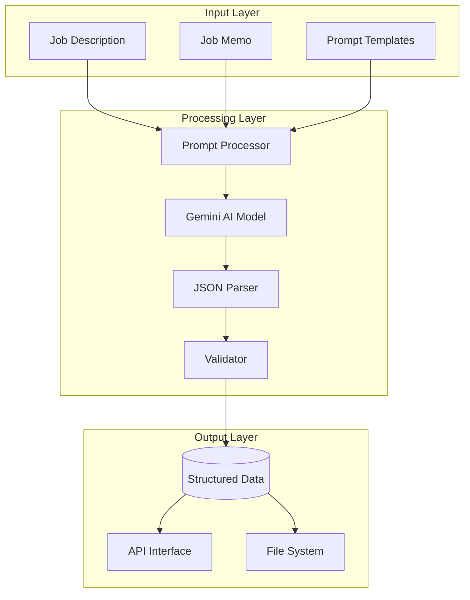

# Design Document

## Overview

The Job Structuring System is designed to transform unstructured job descriptions and memos into a standardized, structured format that can be used for candidate matching, search optimization, and analytics. The system leverages Gemini AI models to extract relevant information and organize it into a consistent JSON structure with clearly defined fields for basic job information, requirements, evaluation points, keywords, search templates, and RAG parameters.

## Architecture

### High-Level Architecture



### Component Architecture

The system follows a modular architecture with clear separation of concerns:

1. **Input Handling**: Manages reading job descriptions and memos from various sources
2. **Prompt Management**: Handles prompt templates and their customization
3. **AI Integration**: Interfaces with the Gemini AI model
4. **JSON Processing**: Parses and validates the AI-generated JSON
5. **Output Management**: Handles saving and distributing the structured data

## Components and Interfaces

### 1. JobStructuringService

**Purpose**: Central orchestrator for the job structuring process.

**Key Methods**:
- `structure_job(job_description: str, job_memo: str) -> dict`
- `structure_job_from_files(job_description_path: str, job_memo_path: str) -> dict`
- `save_structured_job(structured_data: dict, output_path: str) -> bool`

**Interfaces**:
```python
class JobStructuringService:
    def __init__(self, ai_client, prompt_manager):
        self.ai_client = ai_client
        self.prompt_manager = prompt_manager
        self.validator = JobDataValidator()
    
    def structure_job(self, job_description: str, job_memo: str) -> dict:
        """Process job description and memo to create structured data"""
        pass
    
    def structure_job_from_files(self, job_description_path: str, job_memo_path: str) -> dict:
        """Read files and process job data to create structured data"""
        pass
    
    def save_structured_job(self, structured_data: dict, output_path: str) -> bool:
        """Save structured job data to specified output path"""
        pass
```

### 2. AIClient

**Purpose**: Handles communication with the Gemini AI model.

**Key Methods**:
- `generate_content(prompt: str) -> str`
- `extract_json_from_response(response: str) -> dict`

**Interfaces**:
```python
class GeminiAIClient:
    def __init__(self, api_key: str, model_name: str = "gemini-2.5-flash"):
        self.api_key = api_key
        self.model_name = model_name
        self.client = self._initialize_client()
    
    def _initialize_client(self):
        """Initialize the Gemini client"""
        pass
    
    def generate_content(self, prompt: str) -> str:
        """Generate content using the Gemini model"""
        pass
    
    def extract_json_from_response(self, response: str) -> dict:
        """Extract JSON from the model response"""
        pass
```

### 3. PromptManager

**Purpose**: Manages prompt templates and their customization.

**Key Methods**:
- `load_prompt_template(template_path: str) -> str`
- `create_job_structuring_prompt(job_description: str, job_memo: str) -> str`

**Interfaces**:
```python
class PromptManager:
    def __init__(self, templates_dir: str = None):
        self.templates_dir = templates_dir or "."
    
    def load_prompt_template(self, template_path: str) -> str:
        """Load a prompt template from file"""
        pass
    
    def create_job_structuring_prompt(self, job_description: str, job_memo: str) -> str:
        """Create a job structuring prompt by filling in the template"""
        pass
```

### 4. JobDataValidator

**Purpose**: Validates the structure and content of job data.

**Key Methods**:
- `validate_structure(data: dict) -> bool`
- `validate_content(data: dict) -> dict`
- `fix_common_issues(data: dict) -> dict`

**Interfaces**:
```python
class JobDataValidator:
    def __init__(self):
        self.schema = self._load_schema()
    
    def _load_schema(self):
        """Load the JSON schema for validation"""
        pass
    
    def validate_structure(self, data: dict) -> bool:
        """Validate the structure of the job data"""
        pass
    
    def validate_content(self, data: dict) -> dict:
        """Validate the content of the job data and return validation results"""
        pass
    
    def fix_common_issues(self, data: dict) -> dict:
        """Fix common issues in the job data"""
        pass
```

### 5. CLI Interface

**Purpose**: Provides a command-line interface for the job structuring system.

**Key Features**:
- Input file path arguments
- Output file path option
- Verbosity control
- Error handling and reporting

**Interfaces**:
```python
def parse_arguments():
    """Parse command line arguments"""
    pass

def main():
    """Main entry point for the CLI"""
    pass
```

## Data Models

### Job Structure Schema

```json
{
  "basic_info": {
    "title": "string",
    "company": "string",
    "industry": "string",
    "job_type": "string",
    "employment_type": "string",
    "location": "string"
  },
  "requirements": {
    "must_have": [
      {
        "category": "string",
        "item": "string",
        "importance": "number",
        "context": "string"
      }
    ],
    "nice_to_have": [
      {
        "category": "string",
        "item": "string",
        "importance": "number",
        "context": "string"
      }
    ]
  },
  "evaluation_points": [
    {
      "name": "string",
      "description": "string",
      "weight": "number",
      "evaluation_criteria": "string",
      "source": "string"
    }
  ],
  "keywords": {
    "technical": ["string"],
    "soft_skills": ["string"],
    "domain": ["string"],
    "company_culture": ["string"]
  },
  "search_templates": [
    {
      "purpose": "string",
      "template": "string",
      "priority": "number"
    }
  ],
  "rag_parameters": {
    "filters": {
      "industry": ["string"],
      "job_type": ["string"],
      "skills": ["string"]
    },
    "similarity_threshold": "number",
    "relevance_boost_fields": ["string"]
  }
}
```

### Prompt Template Structure

The prompt template is a text file with placeholders for job description and job memo:

```
あなたは求人情報分析の専門家です。以下の求人票と求人メモから、構造化された情報を抽出してください。

# 求人票
[求人票の内容]

# 求人メモ
[求人メモの内容]

# 出力形式
以下のJSON形式で出力してください。各フィールドの説明に従って、適切な情報を抽出してください。

[JSON schema details...]

# 注意事項
[Instructions for extraction...]
```

## Error Handling

### Error Types

1. **Input Errors**: Missing or invalid input files
2. **API Errors**: Issues with the Gemini API
3. **Parsing Errors**: Problems extracting valid JSON from the AI response
4. **Validation Errors**: Structured data not conforming to the expected schema
5. **Output Errors**: Issues saving the structured data

### Error Handling Strategy

```python
class JobStructuringError(Exception):
    """Base class for job structuring errors"""
    pass

class InputError(JobStructuringError):
    """Error for issues with input files"""
    pass

class APIError(JobStructuringError):
    """Error for issues with the AI API"""
    pass

class ParsingError(JobStructuringError):
    """Error for issues parsing the AI response"""
    pass

class ValidationError(JobStructuringError):
    """Error for validation issues with the structured data"""
    pass

class OutputError(JobStructuringError):
    """Error for issues saving the output"""
    pass

def handle_error(error: Exception):
    """Handle errors based on their type"""
    if isinstance(error, InputError):
        # Handle input errors
        pass
    elif isinstance(error, APIError):
        # Handle API errors
        pass
    elif isinstance(error, ParsingError):
        # Handle parsing errors
        pass
    elif isinstance(error, ValidationError):
        # Handle validation errors
        pass
    elif isinstance(error, OutputError):
        # Handle output errors
        pass
    else:
        # Handle unexpected errors
        pass
```

## Testing Strategy

### Unit Testing

1. **Component Testing**: Test each component in isolation
2. **Input Validation**: Test handling of various input formats and edge cases
3. **Error Handling**: Test error detection and recovery
4. **JSON Parsing**: Test extraction and validation of JSON from AI responses

### Integration Testing

1. **End-to-End Processing**: Test complete job structuring pipeline
2. **AI Integration**: Test interaction with the Gemini API
3. **File System Integration**: Test reading and writing files
4. **Error Recovery**: Test recovery from various error conditions

### Test Data Setup

```python
class JobStructuringTestSetup:
    @staticmethod
    def create_test_job_description() -> str:
        """Create a test job description"""
        pass
    
    @staticmethod
    def create_test_job_memo() -> str:
        """Create a test job memo"""
        pass
    
    @staticmethod
    def create_test_prompt_template() -> str:
        """Create a test prompt template"""
        pass
```

## Integration with Existing Systems

### AI Matching System Integration

The structured job data will be used by the AI matching system for candidate evaluation:

```python
class AIMatchingService:
    def __init__(self, job_structuring_service):
        self.job_structuring_service = job_structuring_service
        
    async def process_job(self, job_id: str):
        """Process a job for AI matching"""
        # Get job description and memo
        job_description, job_memo = await self.get_job_data(job_id)
        
        # Structure the job data
        structured_job = self.job_structuring_service.structure_job(
            job_description, job_memo
        )
        
        # Use structured job for matching
        # ...
```

### Web Application Integration

The job structuring service will be integrated with the web application:

```python
@app.post("/api/jobs/{job_id}/structure")
async def structure_job(job_id: str):
    """Structure a job based on its description and memo"""
    # Get job data
    job = await get_job(job_id)
    
    # Structure the job
    structured_job = job_structuring_service.structure_job(
        job.description, job.memo
    )
    
    # Save the structured job
    await save_structured_job(job_id, structured_job)
    
    return {"status": "success", "job_id": job_id}
```

## Performance Considerations

1. **Caching**: Cache structured job data to avoid redundant processing
2. **Asynchronous Processing**: Process jobs asynchronously for better throughput
3. **Batch Processing**: Support batch processing of multiple jobs
4. **Timeout Handling**: Implement timeouts for AI API calls
5. **Rate Limiting**: Respect API rate limits and implement backoff strategies

## Security Considerations

1. **API Key Management**: Securely store and manage API keys
2. **Input Validation**: Validate all inputs to prevent injection attacks
3. **Output Sanitization**: Sanitize structured data before storage or transmission
4. **Error Message Security**: Avoid exposing sensitive information in error messages
5. **Access Control**: Implement proper access controls for job data

This design provides a comprehensive approach to job structuring that addresses all the requirements while ensuring modularity, extensibility, and robustness.