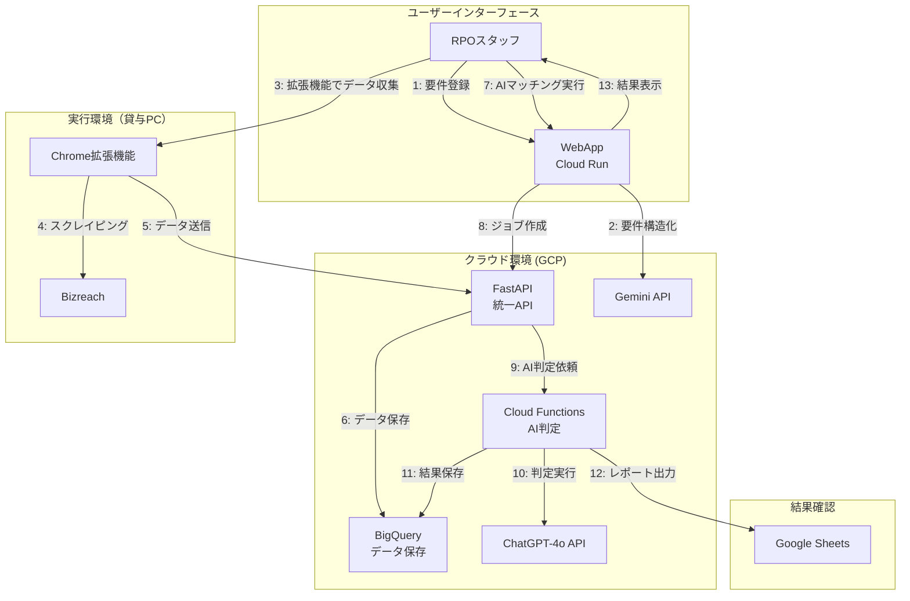

# RPO自動化システム（Chrome拡張機能版）

AI・RPAツールを活用した採用代行業務（RPO）の自動化・効率化システム

## 概要

本システムは、RPO事業者がクライアント企業に代わってBizreachでの候補者スクリーニング、AIによる採用要件マッチング、結果のレポーティングまでを自動化するシステムです。貸与PCからのアクセスしか許可されないといったセキュリティ制約にも対応できる**Chrome拡張機能によるスクレイピング**と、クラウドでの**AI判定・データ管理**を組み合わせた、柔軟な構成でRPO業務の効率化を実現します。

### システム利用者
- **メインユーザー**: RPO事業者のスタッフのみ
- **クライアント企業**: 採用要件を提供し、結果を受け取る（システムに直接アクセスしない）

## 主な機能

### コア機能
- **WebAppによる簡単操作**: ブラウザから採用要件の登録・実行・確認が可能
- **Chrome拡張機能による自動スクリーニング**: Bizreachから候補者情報を自動取得
- **AI判定**: 採用要件との適合性をAIが判定・スコアリング
- **構造化データ管理**: 候補者情報・採用要件をJSON形式で管理
- **レポート生成**: Google Sheetsへの自動出力

### 差別化機能
- **テキストベース採用要件入力**: クライアントから受け取った要件をそのまま入力可能
- **AIによる自動構造化**: 自然言語の要件をGemini APIでJSON化
- **ブラウザ完結型スクレイピング**: 追加ソフトウェアのインストール不要
- **リアルタイム進捗表示**: Chrome拡張機能での視覚的フィードバック
- **クライアント別最適化**: クライアント企業毎の採用パターンを学習

## システム構成



## クイックスタート

### 前提条件

- Python 3.9以上
- GCPアカウント
- Google Workspace
- Bizreachアカウント
- Google Chrome

### インストール

```bash
# リポジトリのクローン
git clone https://github.com/[your-org]/rpo-automation.git
cd rpo-automation

# 仮想環境の作成
python -m venv venv
source venv/bin/activate  # Windows: venv\Scripts\activate

# 依存関係のインストール
pip install -r requirements.txt
```

### 基本設定

1. 環境変数の設定
```bash
cp .env.example .env
# .envファイルを編集して必要な情報を設定
```

2. WebAppの起動
```bash
cd src/web
uvicorn main:app --reload --port 8000
```

3. ブラウザでアクセス
```
http://localhost:8000
```

## 使用方法

### 1. 採用要件の登録
1. WebAppにログイン
2. 「採用要件」画面で新規登録
3. テキストベースで要件を入力（自然言語対応）
4. AIが自動で構造化処理

### 2. 候補者データの収集
1. Bizreachにログイン
2. Chrome拡張機能を起動
3. クライアントを選択
4. Bizreachで検索を実行
5. 「スクレイピング開始」で自動収集

### 3. AI判定の実行
1. WebAppの「AIマッチング」画面へ
2. 採用要件と候補者データを選択
3. 「ジョブ作成」で自動実行
4. 結果をGoogle Sheetsで確認

## ドキュメント

### 設計・アーキテクチャ
- [システムアーキテクチャ](docs/architecture.md) - 全体設計と技術構成
- [データベース設計](docs/database-design.md) - Supabase・BigQueryの詳細設計

### セットアップガイド
- [環境設定](docs/setup/environment.md) - 基本的な開発環境の構築
- [Supabaseセットアップ](docs/setup/supabase.md) - Supabaseプロジェクトの設定
- [BigQueryセットアップ](docs/setup/bigquery.md) - BigQueryプロジェクトの設定
- [Chrome拡張機能セットアップ](docs/setup/chrome-extension.md) - 拡張機能の開発・配布

### 開発ガイド
- [WBS（作業計画書）](docs/development/wbs.md) - 段階的な開発計画
- [テストガイド](docs/development/testing.md) - テスト実行とカバレッジ
- [デプロイガイド](docs/development/deployment.md) - 本番環境への配布

### API仕様
- [API リファレンス](docs/api/reference.md) - FastAPI エンドポイントの詳細

### 運用ガイド
- [監視・メンテナンス](docs/operations/monitoring.md) - システム監視とログ確認
- [トラブルシューティング](docs/operations/troubleshooting.md) - よくある問題と対処法

## プロジェクト構成

```
rpo-automation/
├── src/                     # プログラムの心臓部
│   ├── extension/           # Chrome拡張機能関連
│   ├── ai/                  # AIモデルとの連携
│   ├── data/                # データの変換や整形
│   ├── web/                 # WebApp関連（FastAPI）
│   ├── sheets/              # Google Sheetsとの連携
│   └── utils/               # 共通ユーティリティ
├── config/                  # 設定ファイル
├── tests/                   # テストコード
├── docs/                    # ドキュメント
├── scripts/                 # ビルド・実行スクリプト
└── requirements.txt         # Pythonライブラリの一覧
```

## 技術スタック

- **言語**: Python 3.9+, JavaScript/TypeScript
- **インフラ**: Google Cloud Platform (GCP)
  - Cloud Run (WebApp/FastAPI)
  - Cloud Functions (バックエンド処理)
  - BigQuery (データストア)
- **AI/ML**: Google Gemini, OpenAI ChatGPT-4o
- **WebApp**: FastAPI, Bootstrap
- **データベース**: Supabase (PostgreSQL), BigQuery
- **ブラウザ自動化**: Chrome Extension API
- **連携**: Google Sheets API

## ライセンス

[ライセンスタイプを記載]

## 貢献

プルリクエストを歓迎します。大きな変更の場合は、まずissueを作成して変更内容を議論してください。

## サポート

問題や質問がある場合は、GitHubのissueを作成してください。