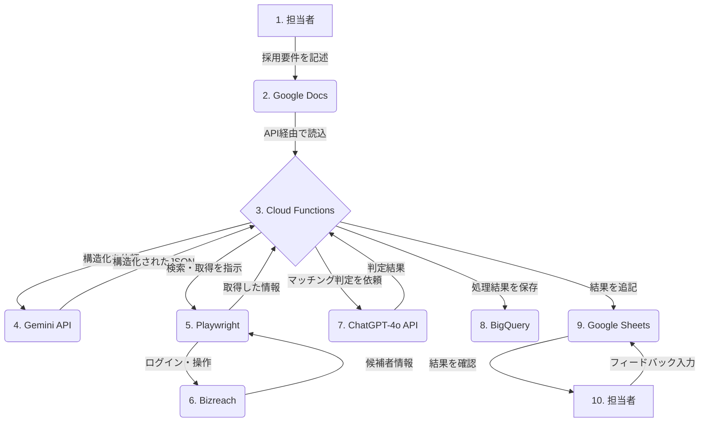

# RPO自動化システム

AI・RPAツールを活用した採用代行業務（RPO）の自動化・効率化システム

## 概要

本システムは、Bizreachでの候補者スクリーニングから、AIによる採用要件マッチング判定、結果のレポーティングまでを自動化し、RPO業務の効率化を実現します。

## システム全体像と処理フロー

このシステムは、複数のクラウドサービスとAIモデルを連携させ、採用業務の自動化を実現します。以下に、データの流れと各コンポーネントの役割を図解します。



**処理フローの詳細:**

1.  **採用要件の定義:** 担当者がGoogle Docsに、求める人物像やスキルセットなどの採用要件を自然言語で記述します。
2.  **ドキュメント読込:** 毎日決まった時間、または手動実行をトリガーに、Cloud FunctionsがGoogle Docs APIを介して採用要件を読み込みます。
3.  **要件の構造化:** Cloud Functionsは、読み込んだ文章をGemini APIに送信し、「必須スキル」「歓迎スキル」「求める人物像」といった項目で整理されたJSON形式のデータに変換します。
4.  **候補者スクレイピング:** 構造化された採用要件に基づき、Playwright（ブラウザ自動化ツール）がBizreachにログインし、関連する候補者を検索・スキャンして、職務経歴などの情報を取得します。
5.  **AIによるマッチング判定:** Cloud Functionsは、取得した候補者一人ひとりの情報と、構造化された採用要件をセットにして、ChatGPT-4o APIに送信します。「この候補者は採用要件にどれくらいマッチしますか？」という問いを投げかけ、マッチングスコア、評価理由、懸念点などを取得します。
6.  **結果の保存と可視化:**
    *   AIの判定結果を含む全ての処理データは、分析とバックアップのために**BigQuery**に保存されます。
    *   担当者が直接確認するために、候補者の情報とAIの判定結果が**Google Sheets**に1行ずつ追記されます。
7.  **フィードバックループ:** 担当者はGoogle Sheets上でAIの判定結果を確認し、「◎（採用）」「△（保留）」などの最終判断を追記します。このフィードバックデータは、将来的にAIのプロンプトを改善し、判定精度を向上させるための教師データとして活用されます。

## クラウドアーキテクチャ (GCP)

本システムは、サーバーレスアーキテクチャを全面的に採用しており、インフラの管理コストを最小限に抑えています。

- **Cloud Functions:**
  - **役割:** すべての処理の起点となるFaaS（Function as a Service）。Pythonで書かれたビジネスロジック（`scripts/daily_screening.py`）を実行します。
  - **トリガー:** **Cloud Scheduler**によって、毎日午前9時などの決まった時間に自動的に起動されます（時間起動）。また、必要に応じて手動で起動することも可能です（手動起動）。

- **Cloud Run:**
  - **役割:** Playwrightのような常時稼働が必要な可能性のある、または長時間実行される可能性のあるプロセスを実行します。Cloud Functionsから呼び出されて、実際のブラウザ操作を行います。
  - **なぜ必要か:** Cloud Functionsには実行時間やメモリの制限があるため、ブラウザを起動するような重い処理は、より柔軟なCloud Runに任せるのが一般的です。

- **BigQuery:**
  - **役割:** 大規模データウェアハウス。処理の過程で生成されるすべてのログ、候補者データ、AIの判定結果などを保存する「公式の記録保管庫」です。データの分析や、過去の判定傾向の確認などに利用します。

- **Secret Manager:**
  - **役割:** APIキーやデータベースのパスワードなど、機密情報を安全に保管・管理します。コード内に直接書き込むことを避け、セキュリティを向上させます。

- **Identity and Access Management (IAM):**
  - **役割:** 各GCPサービスへのアクセス権限を管理します。例えば、「Cloud FunctionsはSecret Managerから秘密情報を読み取れるが、BigQueryのテーブルは削除できない」といった細かい権限設定を行い、最小権限の原則を徹底します。

- **Cloud Logging & Cloud Monitoring:**
  - **役割:** システムの監視を担当します。Cloud Loggingはプログラムの出力ログ（`print`や`logging`）をすべて集約し、エラーの追跡を容易にします。Cloud Monitoringは、エラーの発生回数や関数の実行時間などをグラフで可視化し、異常があればアラートを送信するように設定できます。

## 主な機能

- **自動スクリーニング**: Bizreachから候補者情報を自動取得
- **AI判定**: 採用要件との適合性をAIが判定・スコアリング
- **構造化データ管理**: 候補者情報・採用要件をJSON形式で管理
- **レポート生成**: Google Sheetsへの自動出力
- **学習機能**: クライアントフィードバックを基にした判定精度向上

## システムアーキテクチャ

### 技術スタック

- **言語**: Python 3.9+
- **インフラ**: Google Cloud Platform (GCP)
- **データストア**: BigQuery
- **AI/ML**: 
  - Google Gemini (構造化・プロンプト生成)
  - OpenAI ChatGPT-4o (マッチング判定)
- **ブラウザ自動化**: Playwright
- **連携**: Google Sheets API, Google Docs API

### データフロー

1. **採用要件取得**: Google Docsから要件を取得しJSON構造化
2. **候補者検索**: Bizreachで自動検索・情報取得
3. **AI判定**: 要件と候補者のマッチング判定
4. **結果出力**: Google Sheetsへ結果を記録
5. **フィードバック**: クライアント判断を学習データとして活用

## プロジェクト構成（詳細）

プロジェクトの全体像を把握しやすくするため、各ディレクトリに含まれる主要なファイルとその役割を解説します。

```
rpo-automation/
│
├── src/                     # プログラムの心臓部。ビジネスロジックを格納。
│   │
│   ├── scraping/            # Webサイトから情報を取得するスクレイピング関連
│   │   └── bizreach.py      # Bizreachのサイトを操作し、候補者情報を取得する
│   │
│   ├── ai/                  # AIモデルとの連携やプロンプト生成
│   │   ├── gemini_client.py # Google Gemini APIと通信するためのクライアント
│   │   ├── openai_client.py # OpenAI API(ChatGPT)と通信するためのクライアント
│   │   └── matching_engine.py # 採用要件と候補者情報を基に、AIにマッチング判定を依頼する
│   │
│   ├── data/                # データの変換や整形、構造化を担当
│   │   └── structure.py     # Google Docsから取得した採用要件を、AIが扱いやすいJSON形式に整形する
│   │
│   ├── sheets/              # Google Sheetsとの連携
│   │   └── writer.py        # AIの判定結果をスプレッドシートに書き込む
│   │
│   └── utils/               # 複数の機能で共通して使われる便利機能
│       ├── logging_config.py  # ログの出力形式やレベルを設定する
│       └── env_loader.py      # .envファイルから環境変数を読み込む
│
├── config/                  # 設定ファイルを格納
│   └── settings.py          # プロジェクト全体で利用する定数や設定値（例: タイムアウト秒数）
│
├── tests/                   # プログラムの品質を保証するテストコード
│   ├── unit/                # 関数単位の小さなテスト
│   └── integration/         # 複数の機能を連携させた大きなテスト
│
├── docs/                    # プロジェクトの仕様や設計に関するドキュメント
│   └── troubleshooting.md   # よくある問題と解決策をまとめる
│
├── scripts/                 # プロジェクトのメイン処理を実行するスクリプト
│   └── daily_screening.py   # 日次のスクリーニングタスク（データ取得→AI判定→出力）を実行する
│
├── .env.example             # 環境変数のテンプレートファイル
├── requirements.txt         # プロジェクトに必要なPythonライブラリの一覧
└── README.md                # このファイル。プロジェクトの全体像を説明
```

## セットアップ

### 前提条件

- Python 3.9以上
- GCPアカウント
- Google Workspace
- Bizreachアカウント

### インストール

```bash
# リポジトリのクローン
git clone https://github.com/[your-org]/rpo-automation.git
cd rpo-automation

# 仮想環境の作成
python -m venv venv
source venv/bin/activate  # Windows: venv\Scripts\activate

# 依存関係のインストール
pip install -r requirements.txt
```

### 環境設定

1. GCPプロジェクトの設定
```bash
gcloud init
gcloud config set project [YOUR_PROJECT_ID]
```

2. 環境変数の設定
```bash
cp .env.example .env
# .envファイルを編集して必要な情報を設定
```

### 必要な環境変数

- `GOOGLE_CLOUD_PROJECT`: GCPプロジェクトID
- `BIGQUERY_DATASET`: BigQueryデータセット名
- `OPENAI_API_KEY`: OpenAI APIキー
- `GEMINI_API_KEY`: Gemini APIキー
- `GOOGLE_SHEETS_ID`: 出力先のGoogle Sheets ID

## 使用方法

### 日次実行

```bash
python scripts/daily_screening.py --date 2024-01-01
```

### 個別機能の実行

```bash
# 採用要件の構造化
python -m src.data.structure_requirements --doc-id [GOOGLE_DOC_ID]

# 候補者スクリーニング
python -m src.scraping.bizreach_scraper --job-id [JOB_ID]

# AI判定実行
python -m src.ai.matching_engine --candidate-id [CANDIDATE_ID]
```

## WBS（作業計画書）

このセクションでは、本プロジェクトの開発タスクを詳細に分解したWBS（Work Breakdown Structure）を提示します。
文系出身の新卒エンジニアが一人でタスクを理解し、実装まで進められるように、各タスクの目的、具体的な作業内容、完了の定義、参考情報を記載しています。

### フェーズ1: 環境構築と基礎理解 (目標: 1週間)

**目的:** プロジェクトを自分のPCで動かすための準備を整え、基本的な仕組みを理解する。

| No. | タスク名 | 担当 | 状態 | 期限 | 成果物 | 詳細 |
| :-- | :--- | :--- | :--- | :--- | :--- | :--- |
| 1.1 | **開発環境のセットアップ** | | 未着手 | Day 1 | - | **目的:** Pythonコードを実行できる環境を整える。<br> **作業内容:**<br> - `README`の「前提条件」を確認し、Python 3.9以上がインストールされているか確認する (`python --version`)。<br> - `README`の「インストール」セクションに従い、リポジトリをクローンし、仮想環境(`venv`)を作成・有効化する。<br> - `pip install -r requirements.txt` を実行し、必要なライブラリをインストールする。<br> **完了の定義:** エラーなく`pip install`が完了し、`pip list`でライブラリが確認できること。 |
| 1.2 | **GCP/Google Workspaceのセットアップ** | | 未着手 | Day 2 | - | **目的:** プロジェクトが連携するGoogleサービスを使えるようにする。<br> **作業内容:**<br> - `README`の「環境設定」に従い、`gcloud init`を実行し、手持ちのGCPプロジェクトと連携させる。<br> - Google Docs, Google Sheets APIを有効化する。<br> - サービスアカウントを作成し、キー（JSONファイル）をダウンロードする。<br> **完了の定義:** `gcloud config list`で自分のプロジェクトが表示されること。APIが有効化されていること。 |
| 1.3 | **環境変数の設定** | | 未着手 | Day 3 | `.env`ファイル | **目的:** APIキーなどの秘密情報をコードから分離し、安全に管理する。<br> **作業内容:**<br> - `cp .env.example .env` を実行し、`.env`ファイルを作成する。<br> - `README`の「必要な環境変数」セクションを参考に、ダウンロードしたGCPのキー情報や、別途用意したOpenAI/GeminiのAPIキーなどを`.env`ファイルに書き込む。<br> **完了の定義:** 全ての必須環境変数が`.env`ファイルに設定されていること。 |
| 1.4 | **プロジェクト構成の理解** | | 未着手 | Day 4 | - | **目的:** どこに何のコードがあるか把握する。<br> **作業内容:**<br> - `README`の「プロジェクト構成」を見る。<br> - `src`ディレクトリ内の各サブディレクトリ（`scraping`, `ai`, `data`, `sheets`, `utils`）の役割を推測する。<br> - 各ディレクトリ内のPythonファイル名を眺め、何をするためのファイルか想像してみる。<br> **完了の定義:** 各ディレクトリの役割を自分の言葉で説明できること。 |
| 1.5 | **個別機能の実行（動作確認）** | | 未着手 | Day 5 | - | **目的:** プロジェクトの主要な機能が自分のPCで正しく動くことを確認する。<br> **作業内容:**<br> - `README`の「使用方法」>「個別機能の実行」に記載のコマンドを、ダミーのID（例: `[GOOGLE_DOC_ID]`はテスト用のDocsのID）を使って実行してみる。<br> - エラーが出たら、メッセージを読み、環境変数の設定ミスなどがないか確認する。<br> **完了の定義:** 各コマンドがエラーなく実行できること（正常なエラーメッセージは除く）。 |

---
### フェーズ2: コア機能の実装 (目標: 2週間)

**目的:** システムの中核となる「データ取得」「AI判定」「結果出力」のサイクルを実装する。

| No. | タスク名 | 担当 | 状態 | 期限 | 成果物 | 詳細 |
| :-- | :--- | :--- | :--- | :--- | :--- | :--- |
| 2.1 | **採用要件の構造化 (Gemini)** | | 未着手 | Day 8 | `src/data/structure_requirements.py` | **目的:** Google Docsに書かれた自然文の採用要件を、プログラムで扱いやすいJSON形式に変換する。<br> **作業内容:**<br> - `src/ai/`ディレクトリにGemini APIと通信するクライアント関数を作成する。<br> - `src/data/structure_requirements.py` を実装する。<br>   - Google Docs APIを使い、指定されたIDのドキュメント内容を取得する。<br>   - Gemini APIに「この文章をJSONに構造化してください」というプロンプトと共にドキュメント内容を渡す。<br>   - Geminiからの返却結果（JSON文字列）をPythonの辞書オブジェクトに変換して返す。<br> **完了の定義:** Google DocsのURLを渡すと、構造化された採用要件JSONが返ってくる関数が完成していること。 |
| 2.2 | **Bizreachの自動操作 (Playwright)** | | 未着手 | Day 11 | `src/scraping/bizreach_scraper.py` | **目的:** 手作業で行っていたBizreachの候補者検索と情報取得を自動化する。<br> **作業内容:**<br> - Playwrightの基本的な使い方を学ぶ（`codegen`機能が便利）。<br> - `src/scraping/bizreach_scraper.py` を実装する。<br>   - Playwrightを起動し、Bizreachにログインする処理を書く。<br>   - 検索条件を入力し、検索結果一覧ページに遷移する。<br>   - 一覧から各候補者の詳細ページにアクセスし、職務経歴書などの情報を取得する。<br>   - 取得した情報をPythonのオブジェクトとして整理する。<br> **完了の定義:** 検索条件を渡すと、条件に合致する候補者情報のリストが返ってくる関数が完成していること。 |
| 2.3 | **マッチング判定 (ChatGPT-4o)** | | 未着手 | Day 14 | `src/ai/matching_engine.py` | **目的:** 取得した候補者情報が、採用要件とどれくらいマッチするかをAIに判定させる。<br> **作業内容:**<br> - `src/ai/`ディレクトリにOpenAI APIと通信するクライアント関数を作成する。<br> - `src/ai/matching_engine.py` を実装する。<br>   - 引数として「構造化された採用要件(2.1)」と「候補者情報(2.2)」を受け取る。<br>   - これら2つの情報を基に、ChatGPT-4oに渡すプロンプトを生成する。（例: 「この採用要件と候補者情報を比較し、マッチ度を100点満点で採点し、理由も述べてください」）<br>   - APIを呼び出し、判定結果（スコア、理由）を取得して返す。<br> **完了の定義:** 採用要件と候補者情報を渡すと、AIによる判定結果が返ってくる関数が完成していること。 |
| 2.4 | **Google Sheetsへの出力** | | 未着手 | Day 16 | `src/sheets/writer.py` | **目的:** AIの判定結果を、ビジネスサイドの人が確認しやすいスプレッドシートに記録する。<br> **作業内容:**<br> - Google Sheets APIの基本的な使い方を学ぶ。<br> - `src/sheets/writer.py` を実装する。<br>   - 引数として「候補者情報」と「AI判定結果」を受け取る。<br>   - 環境変数で指定されたGoogle Sheets IDのシートに接続する。<br>   - 受け取った情報を整形し、シートの新しい行に追加する。<br> **完了の定義:** 候補者データと判定結果を渡すと、指定したスプレッドシートに1行追記される関数が完成していること。 |
| 2.5 | **日次実行スクリプトの作成** | | 未着手 | Day 18 | `scripts/daily_screening.py` | **目的:** これまで作成した個別機能(2.1〜2.4)を連携させ、一連の流れを自動で実行する。<br> **作業内容:**<br> - `scripts/daily_screening.py` を実装する。<br>   - 採用要件を取得する(2.1)。<br>   - 候補者を検索・取得する(2.2)。<br>   - 各候補者に対してAI判定を行う(2.3)。<br>   - 判定結果をスプレッドシートに書き出す(2.4)。<br>   - 上記の処理をループで行う。<br> **完了の定義:** `python scripts/daily_screening.py` を実行すると、一連の処理が自動で行われ、スプレッドシートに結果が追記されること。 |

---
### フェーズ3: 実用化と改善 (目標: 1週間)

**目的:** システムを安定稼働させ、より使いやすく、賢くする。

| No. | タスク名 | 担当 | 状態 | 期限 | 成果物 | 詳細 |
| :-- | :--- | :--- | :--- | :--- | :--- | :--- |
| 3.1 | **エラーハンドリングの強化** | | 未着手 | Day 20 | 各種ソースコード | **目的:** 特定の候補者で処理が失敗しても、システム全体が停止しないようにする。<br> **作業内容:**<br> - `try...except`構文を学ぶ。<br> - これまで実装した各機能（特に外部API連携やスクレイピング部分）に、エラーハンドリングを追加する。<br>   - 例: ログイン失敗、情報取得失敗、API通信エラーなど。<br> - エラーが発生した場合は、その情報をログに出力し、処理をスキップして次の候補者に移るようにする。<br> **完了の定義:** 意図的にエラー（例: 間違ったAPIキー）を発生させても、プログラムが異常終了せず、エラーログが記録されること。 |
| 3.2 | **テストコードの作成** | | 未着手 | Day 22 | `tests/` | **目的:** 機能の変更によって、既存の機能が壊れていないかを自動で確認できるようにする。<br> **作業内容:**<br> - `pytest`の基本的な使い方を学ぶ。<br> - `tests/unit/`ディレクトリに、各関数（例: `src/ai/matching_engine.py`の判定関数）の単体テストを書く。<br>   - ダミーの入力データを用意し、期待通りの出力が返ってくるか検証する。<br> **完了の定義:** `pytest tests/unit/` を実行すると、作成したテストがすべて成功（PASS）すること。 |
| 3.3 | **Cloud Functionsへのデプロイ** | | 未着手 | Day 24 | - | **目的:** 毎日決まった時間に、自分のPCではなくクラウド上で自動的にプログラムを実行させる。<br> **作業内容:**<br> - `README`の「デプロイ」セクションを読む。<br> - `gcloud functions deploy` コマンドを使い、`scripts/daily_screening.py` を実行する関数をデプロイする。<br> - `--trigger-schedule` オプションで、毎日午前9時に実行されるように設定する。<br> **完了の定義:** GCPコンソール上でCloud Functionsのデプロイが成功し、指定した時間に実行ログが記録されること。 |
| 3.4 | **フィードバック機能の検討** | | 未着手 | Day 25 | `docs/feedback_design.md` | **目的:** AIの判定結果が正しかったか、人間がフィードバックする仕組みを考え、AIの精度向上に繋げる。<br> **作業内容:**<br> - スプレッドシートに「人間による最終判断」列を追加することを考える。<br> - そのフィードバックをどうやって収集し、どうやって次のAI判定のプロンプトに活かすか、アイデアをMarkdownファイルにまとめる。<br> **完了の定義:** フィードバックの仕組みに関する設計案がドキュメントとしてまとまっていること。 |

## テスト

```bash
# ユニットテスト
pytest tests/unit/

# 統合テスト
pytest tests/integration/

# カバレッジレポート
pytest --cov=src tests/
```

## デプロイ

```bash
# Cloud Functionsへのデプロイ
gcloud functions deploy daily-screening \
    --runtime python39 \
    --trigger-schedule "0 9 * * *" \
    --entry-point main
```

## 運用

### 監視

- Cloud Logging でエラーログを監視
- BigQuery で処理統計を確認

### トラブルシューティング

よくある問題と対処法は[docs/troubleshooting.md](docs/troubleshooting.md)を参照

## ライセンス

[ライセンスタイプを記載]

## 貢献

プルリクエストを歓迎します。大きな変更の場合は、まずissueを作成して変更内容を議論してください。

## サポート

問題や質問がある場合は、GitHubのissueを作成してください。