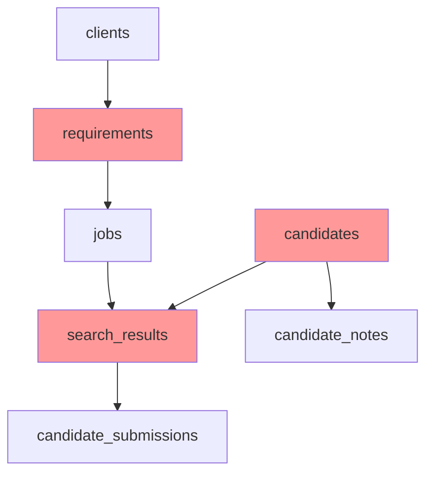

# 不足している必要なテーブル

## 🔴 絶対に必要なテーブル（優先度：高）

### 1. **requirements（採用要件）**
```sql
CREATE TABLE requirements (
    id TEXT PRIMARY KEY DEFAULT gen_random_uuid()::TEXT,
    client_id UUID NOT NULL REFERENCES clients(id),
    position_name VARCHAR(255) NOT NULL,
    description TEXT,
    required_skills TEXT[],
    preferred_skills TEXT[],
    experience_years_min INTEGER,
    experience_years_max INTEGER,
    salary_min INTEGER,
    salary_max INTEGER,
    location VARCHAR(255),
    employment_type VARCHAR(50),
    headcount INTEGER DEFAULT 1,
    status VARCHAR(50) DEFAULT 'draft',
    created_by UUID REFERENCES profiles(id),
    created_at TIMESTAMPTZ DEFAULT NOW(),
    updated_at TIMESTAMPTZ DEFAULT NOW()
);
```
**理由**: 
- 全ての検索の基準となる情報
- クライアントの要望を構造化して保存
- jobsテーブルのrequirement_idが参照する先

### 2. **candidates（候補者マスタ）**
```sql
CREATE TABLE candidates (
    id UUID PRIMARY KEY DEFAULT gen_random_uuid(),
    external_id VARCHAR(255),
    source VARCHAR(50) NOT NULL,
    email VARCHAR(255),
    profile_data JSONB NOT NULL,
    skills TEXT[],
    experience_years INTEGER,
    current_position VARCHAR(255),
    current_company VARCHAR(255),
    location VARCHAR(255),
    is_active BOOLEAN DEFAULT true,
    created_at TIMESTAMPTZ DEFAULT NOW(),
    updated_at TIMESTAMPTZ DEFAULT NOW(),
    UNIQUE(external_id, source)
);
```
**理由**:
- 候補者情報の一元管理
- 重複防止（同じ候補者を何度も提案しない）
- 候補者の履歴追跡

### 3. **search_results（検索結果）**
```sql
CREATE TABLE search_results (
    id UUID PRIMARY KEY DEFAULT gen_random_uuid(),
    job_id UUID NOT NULL REFERENCES jobs(id),
    candidate_id UUID NOT NULL REFERENCES candidates(id),
    match_score DECIMAL(5,2),
    match_details JSONB,
    status VARCHAR(50) DEFAULT 'new',
    review_notes TEXT,
    reviewed_by UUID REFERENCES profiles(id),
    reviewed_at TIMESTAMPTZ,
    created_at TIMESTAMPTZ DEFAULT NOW(),
    UNIQUE(job_id, candidate_id)
);
```
**理由**:
- jobsとcandidatesを結ぶ中間テーブル
- マッチングスコアの保存
- レビュープロセスの管理

## 🟡 あると便利なテーブル（優先度：中）

### 4. **requirement_templates（要件テンプレート）**
```sql
CREATE TABLE requirement_templates (
    id UUID PRIMARY KEY DEFAULT gen_random_uuid(),
    template_name VARCHAR(255) NOT NULL,
    position_type VARCHAR(100),
    template_data JSONB,
    is_active BOOLEAN DEFAULT true,
    created_by UUID REFERENCES profiles(id),
    created_at TIMESTAMPTZ DEFAULT NOW()
);
```
**理由**: よく使う要件をテンプレート化して効率化

### 5. **candidate_notes（候補者メモ）**
```sql
CREATE TABLE candidate_notes (
    id UUID PRIMARY KEY DEFAULT gen_random_uuid(),
    candidate_id UUID REFERENCES candidates(id),
    note_type VARCHAR(50),
    note_text TEXT,
    created_by UUID REFERENCES profiles(id),
    created_at TIMESTAMPTZ DEFAULT NOW()
);
```
**理由**: 候補者に関する追加情報や面談メモの記録

## 🟢 将来的に検討（優先度：低）

### 6. **search_criteria_presets（検索条件プリセット）**
- よく使う検索条件を保存

### 7. **candidate_interactions（候補者とのやり取り履歴）**
- メール送信、電話連絡などの記録

## 📊 テーブル関係図



## 🚀 実装順序の推奨

1. **Phase 1（今すぐ）**: requirements
   - 採用要件管理機能を動かすため

2. **Phase 2（次に）**: candidates + search_results
   - 検索機能を実装するため
   - この2つはセットで必要

3. **Phase 3（その後）**: テンプレートやメモ機能
   - 運用効率を上げるため