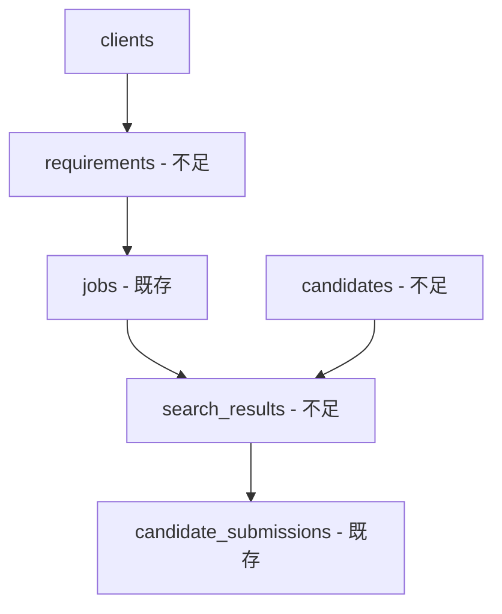

# テーブル構造の比較分析

## 📊 現在のテーブル vs 必要なテーブル

### ✅ 既に存在するテーブル
1. **profiles** - ユーザー管理 ✓
2. **clients** - クライアント企業管理 ✓
3. **jobs** - ジョブ管理（おそらくsearch_jobsの代替）
4. **candidate_submissions** - 候補者提出管理
5. **client_settings** - クライアント設定
6. **job_status_history** - ジョブステータス履歴
7. **notification_settings** - 通知設定
8. **retry_queue** - リトライキュー

### ❌ 不足している重要なテーブル

#### 1. **requirements（採用要件）**
```
必要な理由：
- 採用要件はシステムの中核
- クライアントごとのポジション管理
- 検索条件の基準となる情報
```

#### 2. **candidates（候補者マスタ）**
```
必要な理由：
- 候補者情報の一元管理
- 重複候補者の防止
- 候補者の履歴追跡
```

#### 3. **search_results（検索結果）**
```
必要な理由：
- 検索結果とマッチングスコアの保存
- レビュー状態の管理
- 候補者選定プロセスの追跡
```

### 🔄 既存テーブルとの関係性



## 🛠️ 推奨アクション

### Option 1: 最小限の追加（推奨）
必要最小限のテーブルのみ追加：

```sql
-- 1. requirements テーブルのみ作成
CREATE TABLE requirements (
    id UUID PRIMARY KEY DEFAULT gen_random_uuid(),
    client_id UUID NOT NULL REFERENCES clients(id),
    position_name VARCHAR(255) NOT NULL,
    description TEXT,
    required_skills TEXT[],
    preferred_skills TEXT[],
    experience_years_min INTEGER,
    experience_years_max INTEGER,
    salary_min INTEGER,
    salary_max INTEGER,
    location VARCHAR(255),
    employment_type VARCHAR(50),
    headcount INTEGER DEFAULT 1,
    status VARCHAR(50) DEFAULT 'draft',
    created_by UUID REFERENCES profiles(id),
    created_at TIMESTAMPTZ DEFAULT NOW(),
    updated_at TIMESTAMPTZ DEFAULT NOW()
);

-- 2. candidates テーブル作成
CREATE TABLE candidates (
    id UUID PRIMARY KEY DEFAULT gen_random_uuid(),
    external_id VARCHAR(255),
    source VARCHAR(50),
    email VARCHAR(255),
    profile_data JSONB,
    skills TEXT[],
    experience_years INTEGER,
    current_position VARCHAR(255),
    location VARCHAR(255),
    is_active BOOLEAN DEFAULT true,
    created_at TIMESTAMPTZ DEFAULT NOW(),
    updated_at TIMESTAMPTZ DEFAULT NOW()
);

-- 3. search_results テーブル作成
CREATE TABLE search_results (
    id UUID PRIMARY KEY DEFAULT gen_random_uuid(),
    job_id UUID REFERENCES jobs(id),
    candidate_id UUID REFERENCES candidates(id),
    requirement_id UUID REFERENCES requirements(id),
    match_score DECIMAL(5,2),
    match_details JSONB,
    status VARCHAR(50) DEFAULT 'new',
    review_notes TEXT,
    reviewed_by UUID REFERENCES profiles(id),
    reviewed_at TIMESTAMPTZ,
    created_at TIMESTAMPTZ DEFAULT NOW()
);
```

### Option 2: 既存テーブルの活用
既存の`jobs`テーブルを`search_jobs`として使用し、以下を追加：
- `requirement_id`カラムを`jobs`テーブルに追加
- `candidates`テーブルの作成
- `search_results`を作成（`job_id`で関連付け）

### Option 3: 完全な再設計
既存テーブルとの整合性を取りながら、理想的な構造に移行

## 💡 既存テーブルの活用方法

### candidate_submissions
- 用途：クライアントに提出した候補者の管理
- search_results → candidate_submissionsの流れ

### job_status_history
- 用途：ジョブの状態変化を記録
- 監査ログとして活用

### client_settings
- 用途：クライアントごとの設定
- 検索パラメータのデフォルト値など

### notification_settings
- 用途：通知設定の管理
- ジョブ完了時の通知先など

### retry_queue
- 用途：失敗したジョブのリトライ管理
- API制限やエラー時の再実行