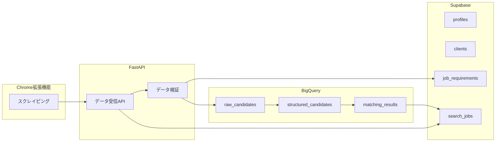

# データベース設計

本システムは2つのデータベースサービスを使い分けることで、パフォーマンスとコストの最適化を実現します。

## 1. Supabase (PostgreSQL互換)

**目的**: WebAppのマスターデータ、トランザクションデータ、およびリアルタイムな参照・更新が必要なデータを保存します。ユーザー管理、クライアント管理、採用要件のマスター、ジョブのステータス管理など、WebAppの機能に密接に関連するデータを扱います。

### Supabaseテーブル詳細設計

#### profiles（ユーザープロファイル）
| カラム名 | 型 | 制約 | 説明 |
|---|---|---|---|
| id | UUID | PK, FK(auth.users.id) | ユーザーID (Supabase Authと連携) |
| full_name | TEXT | | 氏名 |
| role | TEXT | CHECK | ロール（admin/user） |
| department | TEXT | | 所属部署 |
| avatar_url | TEXT | | アバター画像URL |
| created_at | TIMESTAMPTZ | DEFAULT NOW() | 作成日時 |
| updated_at | TIMESTAMPTZ | DEFAULT NOW() | 更新日時 |

#### clients（クライアント企業）
| カラム名 | 型 | 制約 | 説明 |
|---|---|---|---|
| id | UUID | PK | クライアントID |
| name | TEXT | NOT NULL | 企業名 |
| industry | TEXT | | 業界 |
| size | TEXT | | 企業規模 |
| contact_person | TEXT | | 担当者名 |
| contact_email | TEXT | | 担当者メール |
| bizreach_search_url | TEXT | | Bizreach検索URL（オプション） |
| is_active | BOOLEAN | DEFAULT true | 有効フラグ |
| created_at | TIMESTAMPTZ | DEFAULT NOW() | 作成日時 |
| updated_at | TIMESTAMPTZ | DEFAULT NOW() | 更新日時 |

#### client_settings（クライアント別設定）
| カラム名 | 型 | 制約 | 説明 |
|---|---|---|---|
| id | UUID | PK | 設定ID |
| client_id | UUID | FK(clients.id) | クライアントID |
| setting_key | TEXT | UNIQUE(client_id, setting_key) | 設定キー |
| setting_value | JSONB | | 設定値（JSON形式） |
| created_at | TIMESTAMPTZ | DEFAULT NOW() | 作成日時 |
| updated_at | TIMESTAMPTZ | DEFAULT NOW() | 更新日時 |

#### job_requirements（採用要件マスター）
| カラム名 | 型 | 制約 | 説明 |
|---|---|---|---|
| id | UUID | PK | 要件ID |
| client_id | UUID | FK(clients.id) | クライアントID |
| title | TEXT | NOT NULL | タイトル |
| description | TEXT | | 詳細説明 |
| structured_data | JSON | | 構造化データ |
| is_active | BOOLEAN | DEFAULT true | 有効フラグ |
| created_at | TIMESTAMPTZ | DEFAULT NOW() | 作成日時 |
| created_by | UUID | FK(profiles.id) | 作成者（profiles.id） |
| updated_at | TIMESTAMPTZ | DEFAULT NOW() | 更新日時 |

#### search_jobs（検索・AIマッチングジョブ）
| カラム名 | 型 | 制約 | 説明 |
|---|---|---|---|
| id | UUID | PK | ジョブID |
| user_id | UUID | FK(profiles.id) | 実行ユーザーID |
| client_id | UUID | FK(clients.id) | クライアントID |
| job_type | TEXT | CHECK | ジョブタイプ（e.g., 'scraping', 'ai_matching'） |
| status | TEXT | CHECK | ステータス（pending/in_progress/completed/failed） |
| started_at | TIMESTAMPTZ | DEFAULT NOW() | 開始日時 |
| completed_at | TIMESTAMPTZ | | 完了日時 |
| total_candidates_processed | INTEGER | DEFAULT 0 | 処理候補者数 |
| job_parameters | JSONB | | ジョブ実行パラメータ（検索条件、要件IDなど） |
| error_details | TEXT | | エラー詳細 |

#### job_status_history（ジョブステータス履歴）
| カラム名 | 型 | 制約 | 説明 |
|---|---|---|---|
| id | UUID | PK | 履歴ID |
| job_id | UUID | FK(search_jobs.id) | ジョブID |
| status | TEXT | NOT NULL | ステータス |
| message | TEXT | | メッセージ |
| created_at | TIMESTAMPTZ | DEFAULT NOW() | 作成日時 |

#### candidates（候補者マスター）
| カラム名 | 型 | 制約 | 説明 |
|---|---|---|---|
| id | UUID | PK | 候補者ID |
| bizreach_url | TEXT | UNIQUE | Bizreachの候補者URL |
| name | TEXT | | 氏名 |
| email | TEXT | UNIQUE | メールアドレス |
| phone | TEXT | | 電話番号 |
| current_company | TEXT | | 現在の会社 |
| current_position | TEXT | | 現在の役職 |
| experience_years | INTEGER | | 経験年数 |
| skills | TEXT[] | | スキル一覧 |
| education | TEXT | | 学歴 |
| created_at | TIMESTAMPTZ | DEFAULT NOW() | 作成日時 |
| updated_at | TIMESTAMPTZ | DEFAULT NOW() | 更新日時 |

#### candidate_submissions（候補者データ提出履歴）
| カラム名 | 型 | 制約 | 説明 |
|---|---|---|---|
| id | UUID | PK | 提出履歴ID |
| candidate_id | UUID | FK(candidates.id) | 候補者ID |
| search_job_id | UUID | FK(search_jobs.id) | 関連する検索ジョブID |
| submission_time | TIMESTAMPTZ | DEFAULT NOW() | 提出日時 |
| source | TEXT | | データソース（e.g., 'Bizreach Extension'） |
| raw_data | JSONB | | 元のスクレイピング生データ |
| submitted_by_user_id | UUID | FK(profiles.id) | 提出者ユーザーID |

#### search_results（検索結果）
| カラム名 | 型 | 制約 | 説明 |
|---|---|---|---|
| id | UUID | PK | 結果ID |
| search_job_id | UUID | FK(search_jobs.id) | 関連する検索ジョブID |
| candidate_id | UUID | FK(candidates.id) | 候補者ID |
| job_requirement_id | UUID | FK(job_requirements.id) | 関連する採用要件ID |
| match_score | FLOAT | | マッチスコア（0-100） |
| match_reasons | TEXT[] | | マッチ理由のリスト |
| ai_evaluation_details | JSONB | | AI評価の詳細（JSON形式） |
| evaluated_at | TIMESTAMPTZ | DEFAULT NOW() | 評価日時 |

#### notification_settings（通知設定）
| カラム名 | 型 | 制約 | 説明 |
|---|---|---|---|
| id | UUID | PK | 設定ID |
| profile_id | UUID | FK(profiles.id) | ユーザープロファイルID |
| notification_type | TEXT | CHECK | 通知タイプ（e.g., 'email', 'in_app', 'slack'） |
| enabled | BOOLEAN | DEFAULT true | 有効/無効 |
| frequency | TEXT | | 通知頻度（e.g., 'instant', 'daily', 'weekly'） |
| created_at | TIMESTAMPTZ | DEFAULT NOW() | 作成日時 |
| updated_at | TIMESTAMPTZ | DEFAULT NOW() | 更新日時 |

#### retry_queue（リトライキュー）
| カラム名 | 型 | 制約 | 説明 |
|---|---|---|---|
| id | UUID | PK | リトライID |
| operation_type | TEXT | NOT NULL | 操作タイプ（e.g., 'candidate_submission', 'ai_matching'） |
| payload | JSONB | NOT NULL | リトライに必要なデータ |
| retries_attempted | INTEGER | DEFAULT 0 | リトライ試行回数 |
| last_attempt_at | TIMESTAMPTZ | | 最終試行日時 |
| next_retry_at | TIMESTAMPTZ | NOT NULL | 次回リトライ日時 |
| status | TEXT | CHECK | ステータス（e.g., 'pending', 'retrying', 'failed', 'completed'） |
| error_message | TEXT | | エラーメッセージ |
| created_at | TIMESTAMPTZ | DEFAULT NOW() | 作成日時 |
| updated_at | TIMESTAMPTZ | DEFAULT NOW() | 更新日時 |

### Row Level Security (RLS) ポリシー
- **profiles**: 本人のみ更新可能、adminは全て閲覧・更新可能
- **clients**: 全スタッフが閲覧可能、adminのみ編集可能
- **client_settings**: 関連するクライアントのスタッフが閲覧可能、adminのみ編集可能
- **job_requirements**: 関連するクライアントのスタッフが閲覧・編集可能、adminは全て閲覧・編集可能
- **search_jobs**: 本人のジョブのみ閲覧可能、adminは全て閲覧可能
- **job_status_history**: 関連するジョブのユーザーが閲覧可能、adminは全て閲覧可能
- **candidates**: 全スタッフが閲覧可能、adminのみ編集可能
- **candidate_submissions**: 関連するユーザーが閲覧可能、adminは全て閲覧可能
- **search_results**: 関連するジョブのユーザーが閲覧可能、adminは全て閲覧可能
- **notification_settings**: 本人のみ閲覧・更新可能
- **retry_queue**: adminのみ閲覧・更新可能

## 2. BigQuery

**目的**: 大規模データの蓄積と分析

### BigQueryテーブル詳細設計

#### rpo_raw_data.raw_candidates（候補者生データ）
| カラム名 | 型 | 説明 |
|---------|----|----|  
| scraped_at | TIMESTAMP | スクレイピング日時 |
| session_id | STRING | スクレイピングセッションID |
| client_id | STRING | クライアントID |
| client_name | STRING | クライアント名 |
| candidate_url | STRING | 候補者URL |
| raw_html | STRING | HTML生データ |
| raw_data | JSON | スクレイピングデータ |
| scraped_by_user_id | STRING | スクレイピング実行者 |

#### rpo_structured_data.structured_candidates（構造化済み候補者データ）
| カラム名 | 型 | 説明 |
|---------|----|----|  
| candidate_id | STRING | 候補者ID |
| original_url | STRING | 元URL |
| client_id | STRING | クライアントID |
| name | STRING | 氏名 |
| current_company | STRING | 現在の会社 |
| position | STRING | 現在のポジション |
| skills | ARRAY<STRING> | スキル一覧 |
| experience_years | INTEGER | 経験年数 |
| education | STRING | 学歴 |
| structured_at | TIMESTAMP | 構造化日時 |
| structured_data | JSON | 全構造化データ |
| structuring_model | STRING | 構造化に使用したモデル |

#### rpo_structured_data.job_requirements（採用要件スナップショット）
| カラム名 | 型 | 説明 |
|---------|----|----|
| id | STRING | 要件ID（Supabaseのjob_requirements.idに対応） |
| client_id | STRING | クライアントID |
| title | STRING | 募集タイトル |
| position | STRING | 職種 |
| description | STRING | 詳細説明 |
| required_skills | ARRAY<STRING> | 必須スキル |
| preferred_skills | ARRAY<STRING> | 歓迎スキル |
| experience_years | INTEGER | 必要経験年数 |
| education_level | STRING | 学歴要件 |
| salary_range | STRUCT | 給与レンジ |
| work_location | STRING | 勤務地 |
| employment_type | STRING | 雇用形態 |
| original_text | STRING | 原本テキスト |
| structured_data | JSON | 構造化データ |
| created_at | TIMESTAMP | 作成日時 |
| created_by | STRING | 作成者ID |

#### rpo_matching_results.matching_results（マッチング結果）
| カラム名 | 型 | 説明 |
|---------|----|----|
| result_id | STRING | 結果ID |
| job_id | STRING | マッチングジョブID（Supabaseのmatching_jobs.idに対応） |
| candidate_id | STRING | 候補者ID |
| client_id | STRING | クライアントID |
| requirement_id | STRING | 要件ID |
| match_score | FLOAT64 | マッチスコア（0-100） |
| match_reasons | ARRAY<STRING> | マッチ理由 |
| ai_evaluation | JSON | AI評価詳細 |
| evaluated_at | TIMESTAMP | 評価日時 |
| evaluation_model | STRING | 使用モデル |
| model_version | STRING | モデルバージョン |

### データパーティショニング戦略
- **raw_candidates**: scraped_at で日付パーティション
- **structured_candidates**: structured_at で日付パーティション
- **matching_results**: evaluated_at で日付パーティション
- 90日以上古いデータは自動的にコールドストレージへ

## データベース連携

- Chrome拡張機能からのデータはリアルタイムでBigQueryへ保存
- Supabaseはシステム管理とユーザー認証に特化
- クライアント企業のデータは`client_id`で管理

## データフロー図



## インデックス設計

### Supabase
```sql
-- profiles
CREATE INDEX idx_profiles_role ON profiles(role);

-- clients  
CREATE INDEX idx_clients_active ON clients(is_active);

-- job_requirements
CREATE INDEX idx_requirements_client ON job_requirements(client_id);
CREATE INDEX idx_requirements_active ON job_requirements(is_active);

-- search_jobs
CREATE INDEX idx_jobs_user ON search_jobs(user_id);
CREATE INDEX idx_jobs_client ON search_jobs(client_id);
CREATE INDEX idx_jobs_status ON search_jobs(status);

-- candidates
CREATE INDEX idx_candidates_company ON candidates(current_company);
CREATE INDEX idx_candidates_bizreach_url ON candidates(bizreach_url);

-- search_results
CREATE INDEX idx_results_job ON search_results(search_job_id);
CREATE INDEX idx_results_score ON search_results(match_score DESC);
```

### BigQuery
```sql
-- クラスタリング
CREATE TABLE rpo_raw_data.raw_candidates
PARTITION BY DATE(scraped_at)
CLUSTER BY client_id, scraped_by_user_id;

CREATE TABLE rpo_structured_data.structured_candidates  
PARTITION BY DATE(structured_at)
CLUSTER BY client_id, current_company;

CREATE TABLE rpo_matching_results.matching_results
PARTITION BY DATE(evaluated_at)
CLUSTER BY client_id, match_score;
```

## データ保持ポリシー

### Supabase
- ユーザーデータ: 無期限保存
- ジョブデータ: 1年間保存後アーカイブ
- 通知設定: アクティブな間は保存

### BigQuery
- 生データ: 90日間ホットストレージ → コールドストレージ
- 構造化データ: 1年間保持後、集計データのみ保存
- マッチング結果: 2年間保持後、統計データのみ保存

## バックアップ戦略

### Supabase
- 日次自動バックアップ（Supabase Pro以上）
- 手動でのエクスポートスクリプト（週次）

### BigQuery
- データセットレベルでのスナップショット（日次）
- 重要データの他リージョンへのレプリケーション

## 監視とアラート

### パフォーマンス監視
- クエリ実行時間の監視
- テーブルサイズの増加率監視
- インデックス使用率の確認

### アラート設定
- ストレージ使用率 > 80%
- クエリ実行時間 > 30秒
- エラー率 > 5%