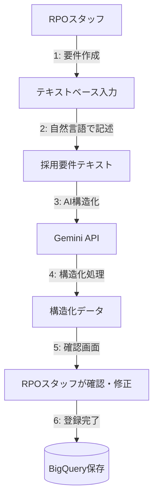
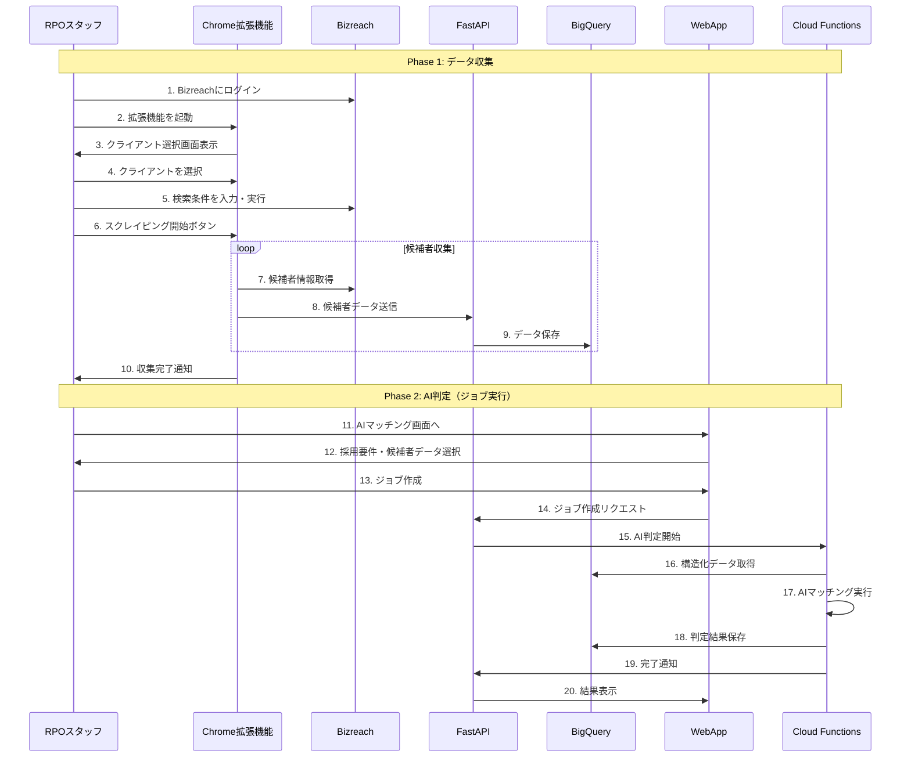

# ユーザーガイド

## WebAppの役割と機能

### WebAppの主要機能

#### 1. 採用要件管理（CRUD操作）
- **新規登録**: テキストベースで要件を入力（自然言語での記述に対応）
- **AI構造化**: 入力されたテキストをGemini APIで自動構造化
- **一覧表示**: 登録済み要件の確認と管理
- **編集・削除**: 既存要件の更新と削除

#### 2. 実行管理
- **AIマッチングジョブ作成**: 採用要件と候補者データが揃った後のAI判定ジョブの作成
- **状況モニタリング**: リアルタイムでの進捗表示
- **エラー通知**: 失敗時の詳細情報表示

#### 3. 結果確認
- **完了通知**: 処理完了の表示
- **統計表示**: 候補者数、マッチ率など
- **詳細リンク**: Google Sheetsへの直接アクセス

#### 4. ユーザー管理
- **認証**: RPOスタッフのログイン機能
- **権限管理**: スタッフの役職別アクセス制御

## ユーザー権限と役割

本システムは、RPO事業者のスタッフの役割に応じて、2つの主要な権限グループ（ロール）を提供します。

### 1. 管理者 (Admin)

**目的:** システム全体の管理、運用、監視を行う。

**主な機能と権限:**
- **ダッシュボード:** システム全体の統計情報（アクティブユーザー数、実行中ジョブ数など）や、システムの状態（APIサーバー、DB接続）を監視できる。
- **ユーザー管理:** システムを利用するスタッフのアカウント（`user`ロール）を作成、編集、削除できる。
- **クライアント割り当て:** 作成したユーザーに、担当するクライアント企業を割り当てることができる。
- **クライアント管理:** 取引先のクライアント企業情報を登録、編集、削除できる。
- **採用要件管理:** 全てのクライアントの採用要件を横断して管理できる。
- **ジョブ管理:** 全ての実行ジョブの状況を監視し、必要に応じてジョブの停止や再実行を行える。
- **分析レポート:** システムに蓄積されたデータから、高度な分析レポートを作成・閲覧できる。
- **システム設定:** アプリケーションの動作に関わる設定（AIモデルの選択、通知設定など）を変更できる。

### 2. 一般ユーザー (User)

**目的:** 管理者から割り当てられた担当クライアントの採用業務を効率的に実行する。

**主な機能と権限:**
- **ダッシュボード:** 自分の担当業務に関連する情報（本日のタスク、最近の検索結果など）を一覧で確認できる。
- **採用要件管理:** 担当するクライアントの採用要件を作成、編集、削除できる。
- **候補者検索:** Chrome拡張機能を使用してBizreachから候補者検索を実行できる。
- **検索結果確認:** AIによるマッチング結果（スコア、理由）を確認し、レポートを出力できる。
- **実行履歴:** 自分が過去に実行したジョブの履歴を確認できる。

## システム全体のワークフロー

### データ収集とAI判定の2段階プロセス

本システムは、データ収集とAI判定を明確に分離した2段階プロセスを採用しています：

1. **データ収集フェーズ**: Chrome拡張機能による候補者情報のスクレイピング
2. **AI判定フェーズ**: 採用要件と候補者データが揃った後のマッチング処理

### Phase 1: 採用要件の登録



**特徴的な機能:**
- **テキストベース入力**: クライアントから受け取った採用要件をそのままテキストで入力
- **AI自動構造化**: 自然言語で書かれた要件をGemini APIが自動でJSON構造化
- **構造化結果の確認**: AIが構造化した結果を人間が確認・修正可能

### Phase 2: 候補者検索の実行（Chrome拡張機能版）

1. Bizreachにログインし、Chrome拡張機能を起動
2. 拡張機能でクライアントを選択
3. Bizreachで直接検索を実行
4. スクレイピングボタンをクリックし、候補者情報を収集
5. 収集したデータをFastAPI経由でBigQueryに保存
6. データは自動的に構造化処理される

### Phase 3: AI判定とレポート生成（ジョブ実行）

1. WebAppから採用要件と候補者データを指定してジョブを作成
2. Cloud FunctionsがBigQueryから構造化済みデータを取得
3. ChatGPT-4oでマッチング判定を実行
4. スコア・評価理由を含むレポートを自動生成
5. Google Sheetsに結果を自動出力
6. RPOスタッフに完了通知

### Phase 4: フィードバックと継続的改善

RPOスタッフからのフィードバックとクライアント企業からの採用結果を蓄積し、AI判定の精度を継続的に向上させます。

## 処理の詳細フロー

### Chrome拡張機能による候補者収集フロー



## 基本的な使い方

### 1. ログイン

1. ブラウザで WebApp にアクセス
2. メールアドレスとパスワードを入力
3. 「ログイン」ボタンをクリック

### 2. 採用要件の登録

1. サイドメニューから「採用要件管理」を選択
2. 「新規作成」ボタンをクリック
3. クライアント企業を選択
4. 採用要件をテキストで入力（例：以下のような形式）
   ```
   【募集職種】バックエンドエンジニア
   【必須スキル】
   - Python 3年以上
   - Django/FastAPIの実務経験
   - AWSでのインフラ構築経験
   【歓迎スキル】
   - 機械学習の基礎知識
   - アジャイル開発経験
   【その他条件】
   - 年収: 600-800万円
   - 勤務地: 東京（リモート可）
   ```
5. 「AI構造化」ボタンをクリック
6. 構造化結果を確認・修正
7. 「保存」ボタンをクリック

### 3. Chrome拡張機能での候補者収集

1. Bizreachにログイン
2. Chrome拡張機能のアイコンをクリック
3. RPOシステムにログイン（初回のみ）
4. クライアント企業を選択
5. Bizreachで検索条件を設定し、候補者一覧を表示
6. 拡張機能の「スクレイピング開始」ボタンをクリック
7. 自動収集が開始され、進捗バーが表示される
8. 収集完了の通知が表示されるまで待つ

### 4. AIマッチングの実行

1. WebAppの「AIマッチング」画面を開く
2. 採用要件を選択
3. 候補者データソースを選択（収集セッションを指定）
4. オプション設定（最小スコア、最大結果数など）
5. 「ジョブ作成」ボタンをクリック
6. ジョブの進捗を確認
7. 完了通知が表示されたら結果を確認

### 5. 結果の確認

1. ジョブ完了後、「結果を見る」ボタンをクリック
2. マッチング結果一覧が表示される
   - 候補者名
   - マッチスコア（0-100）
   - マッチ理由
   - 詳細評価
3. 「Google Sheetsで開く」リンクをクリックして詳細レポートを確認
4. 必要に応じてCSVダウンロード

## トラブルシューティング

### よくある問題と解決方法

#### WebApp関連

**問題**: ログインできない
- パスワードが正しいか確認
- ブラウザのキャッシュをクリア
- 管理者に連絡してアカウントの状態を確認

**問題**: 採用要件のAI構造化が失敗する
- 入力テキストの形式を確認（項目が明確に分かれているか）
- 文字数が多すぎる場合は分割して入力
- エラーメッセージを確認して修正

#### Chrome拡張機能関連

**問題**: 拡張機能が表示されない
- Chromeの拡張機能管理画面で有効になっているか確認
- 拡張機能を再インストール
- Chromeを再起動

**問題**: スクレイピングが途中で停止する
- Bizreachのページ構造が変更された可能性
- ネットワーク接続を確認
- 少し時間を置いてから再試行（レート制限の可能性）

**問題**: 「認証エラー」が表示される
- 拡張機能からログアウトして再ログイン
- トークンの有効期限切れの可能性
- WebApp側でもログイン状態を確認

#### AI判定関連

**問題**: AI判定が開始されない
- 候補者データが正しく収集されているか確認
- 採用要件が選択されているか確認
- ジョブのステータスを確認（エラーが出ていないか）

**問題**: マッチスコアが予想と大きく異なる
- 採用要件の記述が曖昧でないか確認
- 候補者データが正しく構造化されているか確認
- フィードバック機能を使って改善を依頼

### サポート連絡先

技術的な問題が解決しない場合は、以下に連絡してください：

- **システム管理者**: admin@company.com
- **技術サポート**: support@company.com
- **緊急時**: 080-XXXX-XXXX（営業時間内）

## ベストプラクティス

### 採用要件の書き方

1. **明確な項目分け**: 必須スキル、歓迎スキル、その他条件を明確に分ける
2. **具体的な記述**: 「プログラミング経験」ではなく「Python 3年以上」のように具体的に
3. **優先順位の明示**: 最も重要な要件を上位に記載

### 効率的な候補者収集

1. **検索条件の最適化**: Bizreachの検索機能を活用して、対象を絞り込む
2. **バッチサイズ**: 一度に50-100件程度を目安に収集
3. **定期実行**: 毎週決まった曜日に新着候補者をチェック

### 結果の活用

1. **スコアの解釈**: 70点以上が推奨候補、85点以上が優先候補
2. **理由の確認**: スコアだけでなく、マッチ理由を必ず確認
3. **フィードバック**: 実際の選考結果をシステムにフィードバック

## よくある質問（FAQ）

**Q: 一度に収集できる候補者数に制限はありますか？**
A: システム上の制限はありませんが、Bizreachのレート制限を考慮して、一度に100件程度を推奨しています。

**Q: AI判定にはどのくらい時間がかかりますか？**
A: 候補者100名の場合、約5-10分程度です。件数により変動します。

**Q: 過去の判定結果は確認できますか？**
A: はい、「実行履歴」画面から過去のすべてのジョブと結果を確認できます。

**Q: 採用要件は後から編集できますか？**
A: はい、いつでも編集可能です。ただし、実行中のジョブには影響しません。

**Q: Chrome拡張機能は他のブラウザでも使えますか？**
A: 現在はGoogle Chromeのみ対応しています。Edge版は開発予定です。