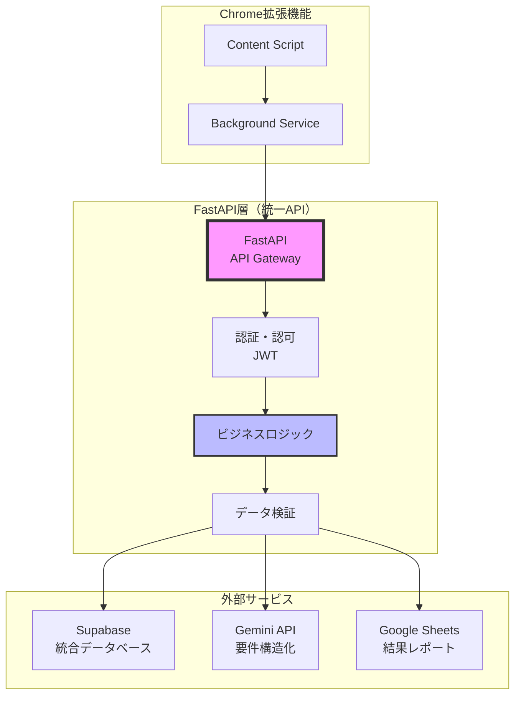
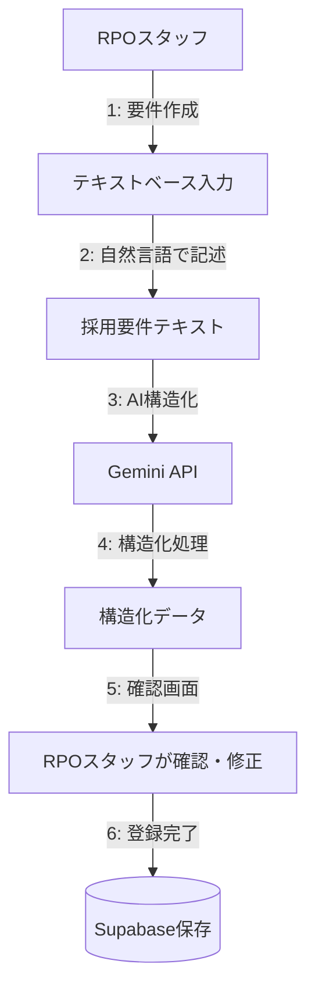
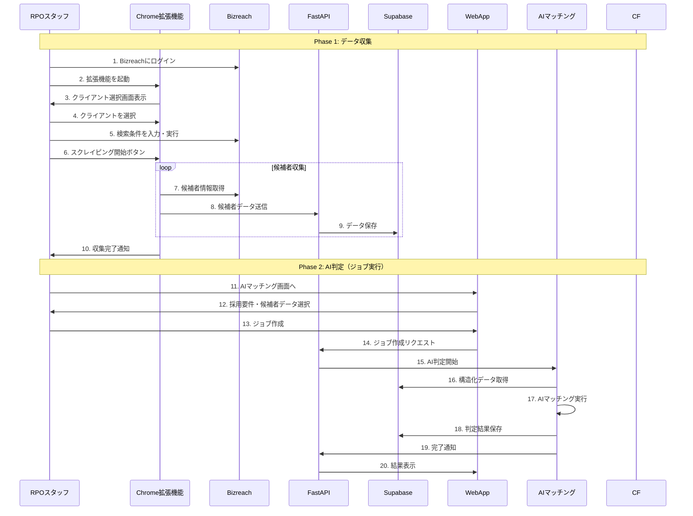

# システムアーキテクチャ

## エンタープライズ向けアーキテクチャ

### システム構成の課題と解決策

本システムは、クライアントのセキュリティポリシーによりBizreachへのアクセスが貸与PCに限定される、といった制約がある環境でも柔軟に動作する必要があります。この課題を解決するため、**Chrome拡張機能によるブラウザ内スクレイピング**を採用し、Pythonエージェントのインストールが不要な軽量な構成を実現しています。

### 主要コンポーネントの役割

#### WebApp（ユーザーインターフェース）
- **採用要件管理**: テキストベースでの要件登録・編集（AIによる自動構造化）
- **AIマッチング実行**: 採用要件と候補者データが揃った後のAI判定ジョブの作成
- **結果確認**: 処理完了通知とGoogle Sheetsへのリンク

#### Chrome拡張機能（スクレイピング実行）
- **認証**: FastAPIからJWTトークンを取得
- **スクレイピング**: Bizreach上で候補者情報を収集
- **データ送信**: 収集したデータをFastAPIへ送信

#### バックエンド処理（自動化の心臓部）
- **データ受信**: Chrome拡張機能からのデータをFastAPI経由で受信
- **AI判定**: Cloud Functionsでバックグラウンド処理
- **データ出力**: 自動的にGoogle Sheets/BigQueryへ保存

### Chrome拡張機能アーキテクチャの主な特徴

1. **軽量インストール**: ブラウザ拡張機能のみで動作、Pythonランタイム不要
2. **リアルタイム連携**: FastAPIとの直接通信でリアルタイムな進捗表示
3. **セキュアな認証**: JWT認証でAPIアクセスを保護
4. **視覚的フィードバック**: スクレイピング中の進捗をブラウザ上で確認可能
5. **クライアント選択機能**: スクレイピング開始時にクライアントを選択

## FastAPIによるAPI統合アーキテクチャ

本システムでは、FastAPIが**API統合ハブ**として機能し、Chrome拡張機能と各種バックエンドサービスを統合しています。

### Chrome拡張機能とFastAPIの連携



### Chrome拡張機能用の主要エンドポイント

| エンドポイント | メソッド | 用途 |
|-------------|---------|-----|
| `/api/auth/extension/login` | POST | 拡張機能用の認証 |
| `/api/clients` | GET | クライアント一覧取得 |
| `/api/candidates/batch` | POST | 候補者データのバッチ送信 |
| `/api/scraping/session/start` | POST | スクレイピングセッション開始 |
| `/api/scraping/session/{session_id}/complete` | POST | セッション完了通知 |

### 実装例：Chrome拡張機能からのデータ送信

```python
# src/web/routers/candidates.py の例
@router.post("/candidates/batch")
async def receive_candidates_batch(
    batch: CandidateBatch,
    current_user: User = Depends(get_current_user),
    session_id: str = Query(...),
    client_id: str = Query(...)
):
    # 1. セッションの有効性確認
    session = await get_scraping_session(session_id)
    if session.user_id != current_user.id:
        raise HTTPException(status_code=403)
    
    # 2. データ検証と整形
    validated_candidates = []
    for candidate in batch.candidates:
        validated = validate_candidate_data(candidate)
        validated['session_id'] = session_id
        validated['client_id'] = client_id
        validated['scraped_by'] = current_user.id
        validated['scraped_at'] = datetime.now()
        validated_candidates.append(validated)
    
    # 3. Supabaseに保存
    try:
        result = await supabase_client.table('candidates').insert(validated_candidates).execute()
    except Exception as e:
        raise HTTPException(status_code=500, detail=f"Database error: {str(e)}")
    
    # 4. セッションの候補者数更新
    await update_session_candidate_count(session_id, len(validated_candidates))
    
    # 5. 統一されたレスポンスを返す
    return {
        "status": "success",
        "received": len(validated_candidates),
        "total": session.candidate_count + len(validated_candidates)
    }
```

## クラウドアーキテクチャ (GCP)

本システムは、サーバーレスアーキテクチャを全面的に採用しており、インフラの管理コストを最小限に抑えています。

### 主要サービス

- **Cloud Run:**
  - **役割:** WebAppとFastAPIのホスティング。Chrome拡張機能からのAPIリクエストを受け付け、認証・データ受信・処理を実行します。
  - **特徴:** オートスケーリング、ゼロスケール対応、HTTPS自動化

- **Cloud Functions:**
  - **役割:** AI判定などのバックエンド処理の実行。FastAPIからのリクエストを受けて、BigQuery操作、AI判定等を実行します。
  - **トリガー:** HTTPリクエスト、Cloud Scheduler

- **Supabase:**
  - **役割:** 統合データベース。ユーザー管理、クライアント管理、採用要件、候補者データ、AI判定結果など、システム全体のデータを一元管理します。

- **Secret Manager:**
  - **役割:** APIキーやデータベースのパスワードなど、機密情報を安全に保管・管理します。

- **Identity and Access Management (IAM):**
  - **役割:** 各GCPサービスへのアクセス権限を管理します。最小権限の原則を徹底します。

- **Cloud Logging & Cloud Monitoring:**
  - **役割:** システムの監視を担当します。ログの集約、エラーの追跡、パフォーマンス監視を行います。

## システム全体のワークフロー

### データ収集とAI判定の2段階プロセス

本システムは、データ収集とAI判定を明確に分離した2段階プロセスを採用しています：

1. **データ収集フェーズ**: Chrome拡張機能による候補者情報のスクレイピング
2. **AI判定フェーズ**: 採用要件と候補者データが揃った後のマッチング処理

### Phase 1: 採用要件の登録



**特徴的な機能:**
- **テキストベース入力**: クライアントから受け取った採用要件をそのままテキストで入力
- **AI自動構造化**: 自然言語で書かれた要件をGemini APIが自動でJSON構造化
- **構造化結果の確認**: AIが構造化した結果を人間が確認・修正可能

### Phase 2: 候補者検索の実行（Chrome拡張機能版）

1. Bizreachにログインし、Chrome拡張機能を起動
2. 拡張機能でクライアントを選択
3. Bizreachで直接検索を実行
4. スクレイピングボタンをクリックし、候補者情報を収集
5. 収集したデータをFastAPI経由でSupabaseに保存
6. データは自動的に構造化処理される

### Phase 3: AI判定とレポート生成（ジョブ実行）

1. WebAppから採用要件と候補者データを指定してジョブを作成
2. AIマッチング機能がSupabaseから構造化済みデータを取得
3. AIでマッチング判定を実行（DeepResearchアルゴリズムを予定）
4. スコア・評価理由を含むレポートを自動生成
5. Google Sheetsに結果を自動出力
6. RPOスタッフに完了通知

### Phase 4: フィードバックと継続的改善

RPOスタッフからのフィードバックとクライアント企業からの採用結果を蓄積し、AI判定の精度を継続的に向上させます。

## 処理の詳細フロー

### Chrome拡張機能による候補者収集フロー



## セキュリティ設計

### Chrome拡張機能のセキュリティ
| 項目 | 実装方法 |
|------|---------|
| APIキー管理 | Chrome Storage APIで暗号化保存 |
| 通信暗号化 | HTTPS必須、証明書ピンニング |
| トークン有効期限 | 1時間、自動リフレッシュ |
| Content Security Policy | 厳格なCSP設定 |

### 環境別の認証情報管理
| 環境 | 管理方法 | 用途 |
|------|---------|-----|
| 開発環境 | .env.development | テストアカウントのみ使用 |
| Chrome拡張機能 | Chrome Storage API | JWTトークンのみ保存 |
| 本番Cloud | Secret Manager | 暗号化して保管、IAMで権限制御 |

### アクセス制御
- **最小権限の原則**: 各サービスアカウントは必要最小限の権限のみ付与
- **役職別アクセス**: 
  - operator: 自分の担当クライアントのみ
  - manager: 全クライアントの閲覧・実行
  - admin: システム設定変更権限

### 監査とコンプライアンス
- 全API呼び出しをSupabaseのaudit_logsテーブルに記録
- Chrome拡張機能のアクティビティログを保持
- ログは90日間保持後、自動アーカイブ
- 定期的なセキュリティレビューの実施

## メリットまとめ

### FastAPI統合アーキテクチャのメリット
- **開発効率**: Chrome拡張機能開発者はFastAPIのみ意識すればOK
- **保守性**: API仕様変更の影響を最小限に
- **拡張性**: 新しいサービス追加が容易
- **監視**: すべてのAPI呼び出しを一元的に監視・ログ記録
- **パフォーマンス**: バッチ処理による効率的なデータ送信