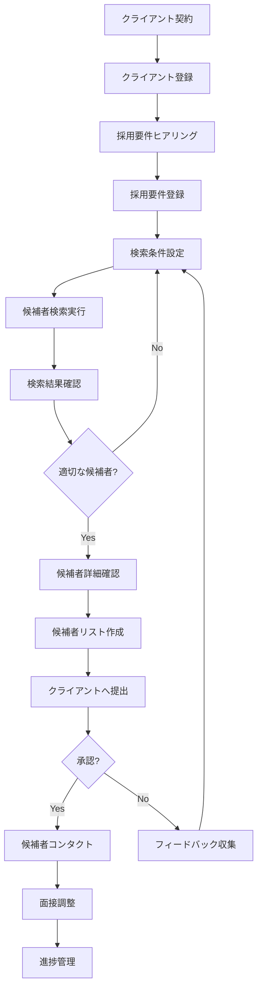

# RPO Automation 運用フロー詳細

## 📋 目次
1. [全体の運用フロー](#全体の運用フロー)
2. [ロール別の作業フロー](#ロール別の作業フロー)
3. [詳細な業務プロセス](#詳細な業務プロセス)
4. [エラー処理とトラブルシューティング](#エラー処理とトラブルシューティング)

---

## 全体の運用フロー



---

## ロール別の作業フロー

### 👤 Admin（管理者）
```
1. システム初期設定
   ├── ユーザーアカウント作成
   ├── クライアント企業登録
   ├── API設定（OpenAI, Bizreach等）
   └── 通知設定（Slack, メール）

2. 運用管理
   ├── ユーザー権限管理
   ├── システム監視
   ├── ジョブ実行状況確認
   └── エラー対応

3. 分析・レポート
   ├── KPI確認
   ├── 月次レポート作成
   └── システム改善提案
```

### 👤 Manager（マネージャー）
```
1. 案件管理
   ├── 採用要件作成・承認
   ├── 検索戦略立案
   └── クライアント対応

2. 品質管理
   ├── 検索結果レビュー
   ├── 候補者リスト承認
   └── オペレーター指導

3. 報告業務
   ├── クライアントへの進捗報告
   └── 社内定例報告
```

### 👤 Operator（オペレーター）
```
1. 日常業務
   ├── 採用要件確認
   ├── 検索実行
   ├── 結果スクリーニング
   └── 候補者情報整理

2. データ管理
   ├── 候補者情報更新
   ├── ステータス管理
   └── 履歴記録

3. レポート作成
   └── 検索結果サマリー作成
```

### 👤 User（一般ユーザー/クライアント）
```
1. 情報確認
   ├── 採用要件確認
   ├── 検索結果閲覧
   └── 進捗確認

2. フィードバック
   └── 候補者評価コメント
```

---

## 詳細な業務プロセス

### 1️⃣ クライアント登録プロセス

**実行者**: Admin
**所要時間**: 10分

1. **基本情報登録**
   - 企業名
   - 企業ID（自動生成）
   - 直接スクレイピング許可設定

2. **アカウント作成**
   - クライアント用ユーザーアカウント作成
   - 権限設定（通常はUserロール）

3. **初期設定**
   - 通知設定
   - レポート頻度設定

### 2️⃣ 採用要件登録プロセス

**実行者**: Manager（作成）→ Admin（承認）
**所要時間**: 30-60分

1. **ヒアリング内容の整理**
   ```
   必須項目：
   - ポジション名
   - 職務内容
   - 必須スキル
   - 勤務地
   - 年収レンジ
   
   任意項目：
   - 歓迎スキル
   - 求める人物像
   - 福利厚生
   - 選考プロセス
   ```

2. **要件登録**
   - システムに情報入力
   - ステータス: Draft → Active

3. **検索キーワード設定**
   - 自動抽出されたキーワードの確認
   - 追加キーワードの設定
   - 除外キーワードの設定

### 3️⃣ 候補者検索プロセス

**実行者**: Operator
**所要時間**: 5-30分（件数による）

1. **検索条件設定**
   ```yaml
   基本条件:
     - 採用要件: 選択
     - キーワード: 複数指定可
     - 経験年数: 範囲指定
     - 勤務地: エリア指定
   
   詳細条件:
     - 必須スキル: AND検索
     - 歓迎スキル: OR検索
     - 年収範囲: Min-Max
     - 業界経験: 複数選択
   
   オプション:
     - 最大取得件数: 50-500
     - 既存候補者除外: ON/OFF
     - アクティブ候補者のみ: ON/OFF
   ```

2. **検索実行**
   - バックグラウンドジョブとして実行
   - 進捗状況リアルタイム更新
   - 完了通知（Slack/メール）

3. **結果確認**
   - マッチ度順にソート
   - 一次スクリーニング実施

### 4️⃣ 候補者スクリーニングプロセス

**実行者**: Operator → Manager
**所要時間**: 1-3時間（100件の場合）

1. **一次スクリーニング（Operator）**
   ```
   確認項目：
   ☐ 必須スキルの充足度
   ☐ 経験年数の適合性
   ☐ 勤務地の一致
   ☐ 年収レンジの適合性
   
   アクション：
   - ✅ 適合 → 「確認済み」ステータス
   - ❌ 不適合 → 「見送り」ステータス
   - ❓ 要確認 → メモ追加
   ```

2. **二次スクリーニング（Manager）**
   ```
   評価項目：
   - キャリアの一貫性
   - スキルの深さ
   - 転職可能性
   - 企業文化との適合性
   
   最終判断：
   - A: 即提出候補
   - B: 予備候補
   - C: 見送り
   ```

### 5️⃣ クライアント提出プロセス

**実行者**: Manager
**所要時間**: 1-2時間

1. **候補者リスト作成**
   - Excelフォーマットで出力
   - 推薦コメント追加
   - マッチポイント明記

2. **提出準備**
   ```
   提出資料：
   1. 候補者リスト（10-30名）
   2. 各候補者のマッチ理由
   3. 推薦優先順位
   4. 次回アクション提案
   ```

3. **フォローアップ**
   - 提出後3日以内に確認連絡
   - フィードバック収集
   - 追加対応の確認

### 6️⃣ 進捗管理プロセス

**実行者**: Manager/Operator
**頻度**: 週次

1. **ステータス更新**
   ```
   候補者ステータス：
   - 新規 → スクリーニング中
   - スクリーニング中 → 提出済み
   - 提出済み → 面接調整中
   - 面接調整中 → 面接実施
   - 面接実施 → 合格/不合格
   ```

2. **レポート作成**
   - 週次進捗レポート
   - KPI実績（提出数、面接設定率等）
   - 課題と改善提案

---

## エラー処理とトラブルシューティング

### ⚠️ よくあるエラーと対処法

1. **検索結果が少ない場合**
   ```
   原因：
   - 検索条件が厳しすぎる
   - キーワードが具体的すぎる
   
   対処：
   1. 必須条件を緩和
   2. 類義語を追加
   3. 経験年数の幅を広げる
   ```

2. **検索ジョブが失敗する場合**
   ```
   原因：
   - API制限到達
   - ネットワークエラー
   - 認証エラー
   
   対処：
   1. エラーログ確認
   2. API使用量確認
   3. 認証情報再設定
   4. リトライ実行
   ```

3. **重複候補者が多い場合**
   ```
   対処：
   1. 「既存候補者除外」オプションON
   2. 検索期間の調整
   3. データベースクリーンアップ
   ```

### 🔄 定期メンテナンス

**週次タスク**
- 検索履歴の確認
- エラーログのレビュー
- 候補者データの重複チェック

**月次タスク**
- KPIレポート作成
- システム使用状況分析
- APIクォータ確認
- データバックアップ

---

## 💡 運用のベストプラクティス

1. **効率的な検索のコツ**
   - 段階的に条件を絞る（広く→狭く）
   - 複数の検索を並行実行
   - 過去の成功パターンを活用

2. **品質向上のポイント**
   - マッチ度60%以上を目安に
   - クライアントフィードバックを蓄積
   - 定期的な検索キーワード見直し

3. **コミュニケーション**
   - 進捗は小まめに共有
   - 課題は早めにエスカレーション
   - 成功事例は横展開
