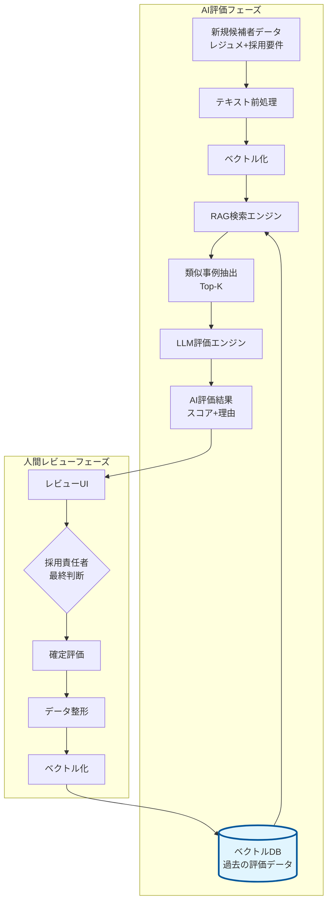

# RAGベース採用評価エージェント実装ガイド

## 1. システム全体像

### アーキテクチャ概要



### 主要コンポーネント

1. **ベクトルデータベース**: 過去の評価データを検索可能な形で保持
2. **RAGエンジン**: 類似事例を検索し、コンテキストとして活用
3. **評価エンジン**: LLMを使用した採点と理由生成
4. **フィードバックループ**: 人間の判断を学習データとして蓄積

## 2. データ構造

### 2.1 ベクトル化前の生データ構造

```python
{
    "id": "eval_20250110_001",
    "timestamp": "2025-01-10T14:30:00Z",
    
    # 入力データ
    "job_requirement": {
        "title": "バックエンドエンジニア",
        "company": "株式会社テックイノベーション",
        "required_skills": ["Python 5年以上", "API開発経験", "AWS"],
        "preferred_skills": ["Docker", "Kubernetes", "マイクロサービス"],
        "team_size": "8名",
        "description": "ECプラットフォームのバックエンド開発..."
    },
    
    "candidate_resume": {
        "name": "候補者A",
        "experience": "8年",
        "current_position": "シニアエンジニア",
        "skills": ["Python", "Django", "FastAPI", "AWS", "Docker"],
        "work_history": "2020-現在: 株式会社〇〇でAPI開発をリード...",
        "achievements": "マイクロサービス化プロジェクトで性能を3倍に改善..."
    },
    
    # 評価結果
    "ai_evaluation": {
        "score": 85,
        "grade": "A",  # A, B, C, D
        "positive_reasons": [
            "必須スキルのPython経験が8年と要件を大幅に上回る",
            "API開発の実績が豊富で、要件と完全に合致",
            "マイクロサービス化の成功経験が歓迎要件と一致"
        ],
        "concerns": [
            "Kubernetes経験が明記されていない",
            "チームサイズが現職で5名、要件の8名より小規模"
        ]
    },
    
    # 人間による最終判断
    "human_review": {
        "final_score": 88,
        "final_grade": "A",
        "reviewer": "採用マネージャー山田",
        "comments": "技術力は申し分なし。チーム規模の懸念は面接で確認",
        "decision": "次選考へ進む"
    }
}
```

### 2.2 ベクトル化後のデータ構造

```python
{
    # ベクトル化用の結合テキスト
    "text": """
    【採用要件】
    職種: バックエンドエンジニア
    必須: Python 5年以上、API開発経験、AWS
    歓迎: Docker、Kubernetes、マイクロサービス
    チーム: 8名
    業務: ECプラットフォームのバックエンド開発
    
    【候補者情報】
    経験年数: 8年
    現職: シニアエンジニア
    スキル: Python、Django、FastAPI、AWS、Docker
    実績: マイクロサービス化プロジェクトで性能を3倍に改善
    """,
    
    # ベクトル（実際は1536次元など）
    "vector": [
        0.0234, -0.0156, 0.0891, -0.0423, 0.0677,
        0.0112, -0.0334, 0.0756, -0.0198, 0.0543,
        # ... 1526個の数値が続く ...
        -0.0087, 0.0465, -0.0232, 0.0819, 0.0123
    ],
    
    # 検索・参照用メタデータ
    "metadata": {
        "id": "eval_20250110_001",
        "final_grade": "A",
        "final_score": 88,
        "positive_summary": "Python経験豊富、API開発実績、マイクロサービス経験",
        "concern_summary": "Kubernetes未確認、チーム規模差",
        "decision": "次選考へ進む",
        "job_id": "job_tech_001",
        "candidate_id": "cand_001"
    }
}
```

## 3. 実装の詳細

### 3.1 ベクトルデータベースの選定と初期化

```python
from langchain.vectorstores import Chroma
from langchain.embeddings import OpenAIEmbeddings
import chromadb

class RecruitmentVectorDB:
    def __init__(self):
        # Embeddingモデルの初期化
        self.embeddings = OpenAIEmbeddings(
            model="text-embedding-3-large"  # 高精度な3072次元
        )
        
        # ChromaDBクライアントの初期化
        self.client = chromadb.PersistentClient(
            path="./recruitment_vectors"
        )
        
        # コレクション（テーブル）の作成
        self.collection = self.client.get_or_create_collection(
            name="recruitment_evaluations",
            metadata={"hnsw:space": "cosine"}  # コサイン類似度を使用
        )
        
        # LangChain用のベクトルストア
        self.vectorstore = Chroma(
            client=self.client,
            collection_name="recruitment_evaluations",
            embedding_function=self.embeddings
        )
```

### 3.2 RAGエージェントの実装

```python
from langchain.agents import AgentExecutor, create_openai_tools_agent
from langchain.tools import Tool
from langchain_core.prompts import ChatPromptTemplate, MessagesPlaceholder
from langchain_openai import ChatOpenAI
import json

class RAGRecruitmentAgent:
    def __init__(self, vector_db: RecruitmentVectorDB):
        self.vector_db = vector_db
        self.llm = ChatOpenAI(model="gpt-4-turbo", temperature=0.2)
        
        # 検索ツールの定義
        self.search_tool = Tool(
            name="search_similar_cases",
            func=self._search_similar_evaluations,
            description="過去の類似した採用評価事例を検索する"
        )
        
        # エージェントのプロンプト
        self.prompt = ChatPromptTemplate.from_messages([
            ("system", """あなたは採用評価の専門家です。
            過去の評価事例を参考にしながら、候補者と採用要件のマッチング度を評価してください。
            
            評価は以下の観点で行ってください：
            1. 必須スキルの充足度
            2. 歓迎スキルの保有状況
            3. 経験年数とレベル感
            4. チーム規模やプロジェクト経験の適合性
            5. 成長ポテンシャル
            
            必ず0-100のスコアとA-Dのグレードで評価してください。"""),
            
            ("human", "{input}"),
            MessagesPlaceholder(variable_name="agent_scratchpad"),
        ])
        
        # エージェントの初期化
        agent = create_openai_tools_agent(
            llm=self.llm,
            tools=[self.search_tool],
            prompt=self.prompt
        )
        
        self.agent_executor = AgentExecutor(
            agent=agent,
            tools=[self.search_tool],
            verbose=True,
            max_iterations=4  # 最大4回の検索
        )
    
    def _search_similar_evaluations(self, query: str) -> str:
        """類似する過去の評価事例を検索"""
        results = self.vector_db.vectorstore.similarity_search_with_score(
            query=query,
            k=3  # Top-3を取得
        )
        
        similar_cases = []
        for doc, score in results:
            case = {
                "similarity_score": round(1 - score, 3),  # 類似度
                "grade": doc.metadata.get("final_grade"),
                "score": doc.metadata.get("final_score"),
                "positive": doc.metadata.get("positive_summary"),
                "concerns": doc.metadata.get("concern_summary"),
                "decision": doc.metadata.get("decision")
            }
            similar_cases.append(case)
        
        return json.dumps(similar_cases, ensure_ascii=False, indent=2)
    
    def evaluate_candidate(self, job_requirement: dict, candidate_resume: dict) -> dict:
        """候補者を評価"""
        # 評価用のテキストを作成
        input_text = self._format_evaluation_input(job_requirement, candidate_resume)
        
        # エージェントを実行
        result = self.agent_executor.invoke({
            "input": input_text
        })
        
        # 結果をパース
        return self._parse_evaluation_result(result["output"])
```

### 3.3 人間のフィードバックを取り込む仕組み

```python
class FeedbackLoop:
    def __init__(self, vector_db: RecruitmentVectorDB):
        self.vector_db = vector_db
    
    def add_human_reviewed_data(self, evaluation_data: dict):
        """人間がレビューした評価データをベクトルDBに追加"""
        
        # テキストの作成
        text = self._create_searchable_text(
            evaluation_data["job_requirement"],
            evaluation_data["candidate_resume"]
        )
        
        # メタデータの準備
        metadata = {
            "id": evaluation_data["id"],
            "final_grade": evaluation_data["human_review"]["final_grade"],
            "final_score": evaluation_data["human_review"]["final_score"],
            "positive_summary": self._summarize_reasons(
                evaluation_data["ai_evaluation"]["positive_reasons"]
            ),
            "concern_summary": self._summarize_reasons(
                evaluation_data["ai_evaluation"]["concerns"]
            ),
            "decision": evaluation_data["human_review"]["decision"],
            "job_id": evaluation_data["job_requirement"].get("id"),
            "candidate_id": evaluation_data["candidate_resume"].get("id"),
            "reviewer": evaluation_data["human_review"]["reviewer"],
            "timestamp": evaluation_data["timestamp"]
        }
        
        # ベクトルDBに追加
        self.vector_db.vectorstore.add_texts(
            texts=[text],
            metadatas=[metadata],
            ids=[evaluation_data["id"]]
        )
        
        print(f"✅ 評価データ {evaluation_data['id']} をベクトルDBに追加しました")
    
    def _create_searchable_text(self, job_req: dict, resume: dict) -> str:
        """検索用のテキストを生成"""
        return f"""
        【採用要件】
        職種: {job_req.get('title')}
        必須: {', '.join(job_req.get('required_skills', []))}
        歓迎: {', '.join(job_req.get('preferred_skills', []))}
        チーム: {job_req.get('team_size')}
        業務: {job_req.get('description', '')[:200]}
        
        【候補者情報】
        経験年数: {resume.get('experience')}
        現職: {resume.get('current_position')}
        スキル: {', '.join(resume.get('skills', []))}
        実績: {resume.get('achievements', '')[:200]}
        """
```

### 3.4 レビューUI（Streamlit実装例）

```python
import streamlit as st
from datetime import datetime

class ReviewUI:
    def __init__(self, agent: RAGRecruitmentAgent, feedback_loop: FeedbackLoop):
        self.agent = agent
        self.feedback_loop = feedback_loop
    
    def run(self):
        st.title("🎯 採用候補者AI評価システム")
        
        # サイドバーで入力
        with st.sidebar:
            st.header("採用要件")
            job_title = st.text_input("職種名")
            required_skills = st.text_area("必須スキル（改行区切り）")
            preferred_skills = st.text_area("歓迎スキル（改行区切り）")
            team_size = st.text_input("チーム規模")
            
            st.header("候補者情報")
            experience = st.text_input("経験年数")
            current_position = st.text_input("現在の役職")
            skills = st.text_area("保有スキル（改行区切り）")
            achievements = st.text_area("主な実績")
            
            if st.button("🤖 AI評価を実行"):
                # AI評価を実行
                self._run_evaluation(...)
        
        # メイン画面で結果表示
        if "ai_result" in st.session_state:
            col1, col2 = st.columns(2)
            
            with col1:
                st.subheader("🤖 AI評価結果")
                st.metric("スコア", st.session_state.ai_result["score"])
                st.metric("グレード", st.session_state.ai_result["grade"])
                st.write("**ポジティブな点:**")
                for reason in st.session_state.ai_result["positive_reasons"]:
                    st.write(f"✅ {reason}")
                
            with col2:
                st.subheader("👤 最終評価（人間）")
                final_score = st.slider("最終スコア", 0, 100, 
                                      st.session_state.ai_result["score"])
                final_grade = st.selectbox("最終グレード", ["A", "B", "C", "D"])
                comments = st.text_area("コメント")
                decision = st.selectbox("判定", 
                                      ["次選考へ進む", "保留", "不採用"])
                
                if st.button("✅ 評価を確定"):
                    self._save_final_evaluation(...)
```

## 4. 実装のポイント

### 4.1 ベクトル化の最適化

1. **適切なEmbeddingモデルの選択**
   - 日本語対応: `multilingual-e5-large`
   - 高精度: `text-embedding-3-large`
   - コスト重視: `text-embedding-3-small`

2. **テキストの前処理**
   - 要件とレジュメの構造化
   - 重要キーワードの強調
   - ノイズの除去

### 4.2 検索精度の向上

1. **ハイブリッド検索**
   ```python
   # キーワード検索とベクトル検索の組み合わせ
   def hybrid_search(self, query, keyword_filters=None):
       vector_results = self.vector_search(query)
       if keyword_filters:
           filtered = [r for r in vector_results 
                      if all(kw in r.text for kw in keyword_filters)]
           return filtered
       return vector_results
   ```

2. **メタデータフィルタリング**
   ```python
   # 同じクライアントや職種の事例を優先
   results = vectorstore.similarity_search(
       query,
       filter={"job_category": "backend_engineer"}
   )
   ```

### 4.3 継続的な改善

1. **定期的な再インデックス**
   - 新しいEmbeddingモデルへの移行
   - テキスト前処理の改善

2. **評価メトリクスの追跡**
   - AIと人間の評価の乖離度
   - 採用成功率との相関

## 5. まとめ

このRAGベースのシステムにより：

1. **初期段階**: 過去のデータから学習してAIが評価
2. **成長段階**: 人間のフィードバックで継続的に改善
3. **成熟段階**: 企業独自の採用基準を完全に理解したAI

という進化を実現できます。