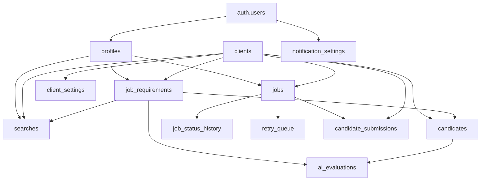

# Supabase テーブル構造全体図

## 目次
1. [概要](#概要)
2. [テーブル一覧と目的](#テーブル一覧と目的)
3. [テーブル間の依存関係](#テーブル間の依存関係)
4. [処理フローとテーブルの関係](#処理フローとテーブルの関係)
5. [今後の拡張予定](#今後の拡張予定)

## 概要

RPO Automationシステムは、採用プロセスの自動化を目的としたシステムで、Supabaseを中心にデータを管理しています。主要な機能は以下の通りです：

- スタッフ管理（認証・権限）
- クライアント企業管理
- 採用要件管理
- 候補者データの収集（スクレイピング）
- AIマッチング評価
- クライアントへの候補者送客

## テーブル一覧と目的

### 1. ユーザー・認証関連

#### **profiles**
- **目的**: RPOスタッフのプロファイル管理
- **主要カラム**: 
  - id (UUID) - Supabase Auth user_idと連携
  - full_name, role (admin/manager/operator)
  - department, is_active
- **依存**: auth.users

### 2. クライアント関連

#### **clients**
- **目的**: クライアント企業の基本情報管理
- **主要カラム**:
  - id (UUID)
  - name, industry, company_size
  - allows_direct_scraping (スクレイピング許可)
  - is_active
- **依存**: なし（ルートテーブル）

#### **client_settings**
- **目的**: クライアント固有の設定情報
- **主要カラム**:
  - client_id (FK)
  - settings (JSONB) - カスタム設定
- **依存**: clients

### 3. 採用要件関連

#### **job_requirements**
- **目的**: 採用要件の詳細情報管理
- **主要カラム**:
  - id (UUID)
  - client_id (FK)
  - title, description
  - structured_data (JSONB) - 必須/歓迎要件など
  - is_active
- **依存**: clients, profiles (created_by)

### 4. 候補者データ関連

#### **candidates**
- **目的**: スクレイピングで収集した候補者データ
- **主要カラム**:
  - id (UUID)
  - candidate_id (媒体での候補者ID)
  - candidate_link, candidate_company
  - candidate_resume (職務経歴)
  - platform (bizreach等)
  - client_id, requirement_id (FK)
- **依存**: clients, job_requirements

### 5. AI評価関連

#### **ai_evaluations**
- **目的**: AIによるマッチング評価結果
- **主要カラム**:
  - id (UUID)
  - candidate_id, requirement_id (FK)
  - ai_score (0-1)
  - match_reasons[], concerns[]
  - recommendation (high/medium/low)
  - detailed_evaluation (JSONB)
- **依存**: candidates, job_requirements

#### **searches**
- **目的**: 検索・スクレイピングセッション管理
- **主要カラム**:
  - id (TEXT)
  - requirement_id, client_id (FK)
  - status (running/completed/failed)
  - total_candidates, evaluated_candidates
  - search_params (JSONB)
- **依存**: job_requirements, clients, profiles

### 6. ジョブ・処理関連

#### **jobs**
- **目的**: バッチ処理ジョブの管理
- **主要カラム**:
  - id (UUID)
  - job_type (ai_matching/search/scrape)
  - status, priority
  - parameters (JSONB)
  - progress, error_message
- **依存**: clients, profiles (created_by)

#### **job_status_history**
- **目的**: ジョブのステータス変更履歴
- **主要カラム**:
  - job_id (FK)
  - old_status, new_status
  - reason
- **依存**: jobs

#### **retry_queue**
- **目的**: 失敗したジョブのリトライ管理
- **主要カラム**:
  - job_id (FK)
  - retry_count, max_retries
  - next_retry_at
- **依存**: jobs

### 7. 送客・フィードバック関連

#### **candidate_submissions**
- **目的**: クライアントへの候補者送客履歴
- **主要カラム**:
  - id (UUID)
  - job_id, client_id (FK)
  - candidate_id
  - status (submitted/reviewing/accepted/rejected)
  - client_feedback
- **依存**: jobs, clients

### 8. 設定関連

#### **notification_settings**
- **目的**: ユーザーごとの通知設定
- **主要カラム**:
  - user_id (FK)
  - email_enabled, slack_webhook_url
  - notify_on_complete, notify_on_error
- **依存**: auth.users

## テーブル間の依存関係



## 処理フローとテーブルの関係

### 1. 採用要件登録フロー
```
1. clients（クライアント選択）
    ↓
2. job_requirements（要件作成）
    ↓
3. structured_data に必須/歓迎要件を格納
```

### 2. 候補者収集フロー
```
1. job_requirements（要件選択）
    ↓
2. searches（検索セッション作成）
    ↓
3. candidates（スクレイピングデータ保存）
    ↓
4. Chrome拡張機能からデータ送信
```

### 3. AIマッチングフロー
```
1. candidates（候補者データ取得）
    ↓
2. ai_evaluations（AI評価実行・保存）
    ↓
3. RAGシステムで過去の成功事例参照
    ↓
4. スコアとレコメンデーション生成
```

### 4. 送客フロー
```
1. ai_evaluations（高評価候補者抽出）
    ↓
2. 人間による最終確認
    ↓
3. candidate_submissions（送客記録）
    ↓
4. クライアントフィードバック更新
```

## 今後の拡張予定

### 1. **pickup_history** テーブル
- AI評価後の人間による選定プロセスを詳細に記録
- pickup_reason（選定理由）を学習データとして活用

### 2. **recruitment_vectors** テーブル
- RAGシステム用のベクトルデータ格納
- pgvector拡張を使用した類似検索

### 3. **client_preferences** テーブル
- クライアントごとの採用傾向を学習
- 過去の採用パターンを分析

### 4. **performance_tracking** テーブル
- 採用後のパフォーマンス追跡
- AIマッチング精度の継続的改善

## セキュリティ設計

全テーブルで以下のセキュリティ対策を実装：

1. **Row Level Security (RLS)**
   - role別のアクセス制御
   - admin: 全データアクセス可
   - manager: 自クライアントのデータのみ
   - operator: 読み取り専用

2. **自動更新トリガー**
   - updated_atの自動更新
   - 監査証跡の確保

3. **外部キー制約**
   - データ整合性の保証
   - CASCADE DELETE設定